# Báo cáo: hiệu ứng đạn và hiển thị linh khí

Hai yêu cầu của chủ dự án:

- (A) "làm hiệu ứng đạn cho tôi nhé"
- (B) "phần linh khí tôi thấy chưa rõ ràng lắm, không biết tôi cày được bao nhiêu linh khí hệ gì"

Linh khí ở đây là **dấu ấn hệ của vũ khí** (Lửa, Độc, Băng). Luật giữ nguyên: kết liễu quái đang dính hiệu ứng hệ nào thì vũ khí nhận dấu ấn hệ đó; hệ nào đủ 30 trước thì vũ khí khoá theo hệ đó; mốc 30 (Mầm), 120 (Thành hình), 300 (Thức tỉnh). Chưa làm phần kết hợp hai hệ (chủ dự án sẽ phác thảo riêng).

## A. Hiệu ứng đạn

Mọi thứ bay trong trận giờ có hình riêng, xoay theo hướng bay, có vệt, có ánh sáng, có hiệu ứng lúc bắn và lúc trúng.

| Chủ của đạn | Hình đạn |
|---|---|
| Quái Hang biển | bọt nước tròn trong, gai băng dài nhọn |
| Quái Rừng già | bào tử lông tơ tím, hạt độc nhọn xanh có giọt tím, quả nổ có ngòi cháy |
| Quái Lâu đài cổ | tàn lửa có đuôi, lá bùa vàng chữ đỏ, đạn pháo bi sắt |
| Mũi tên của mình | lông đuôi màu bậc vũ khí (Lam, Tím, Vàng), đầu tên sáng; tên mang hệ có lửa, nhớt độc hoặc tinh thể băng bọc quanh |

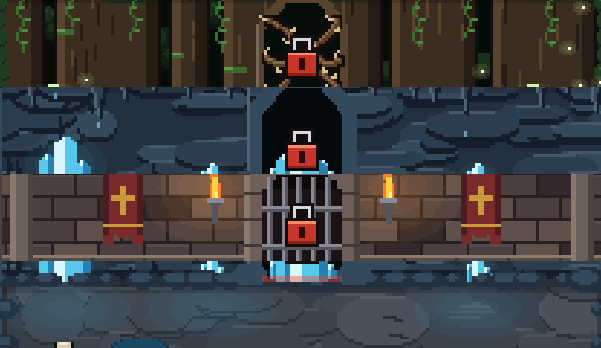

*Ba hàng trên: đạn của quái ở rừng, biển, lâu đài. Hàng dưới: mũi tên của mình (thường, Lửa, Độc, Băng, tên giữ rồi thả).*

- **Phân biệt đạn quái và đạn mình**: đạn quái có viền tối, quầng đỏ và một chấm đỏ nhấp nháy; mũi tên của mình có quầng sáng trắng (hoặc màu hệ).
- **Vệt bay**: đuôi mờ dần, bay càng nhanh vệt càng dài. Đạn hệ có quầng sáng màu hệ (lửa cam, độc lục, băng xanh) và rơi hạt theo đường bay (bọt nổi lên, giọt độc rơi, tinh thể lấp lánh, khói sau đạn pháo).
- **Lúc bắn**: chớp nhỏ ở dây cung hoặc chỗ quái bắn ra.
- **Lúc trúng**: toé hạt theo hệ, vòng sóng nhỏ, chớp sáng; số sát thương vẫn hiện như cũ.
- **Trúng tường**: mũi tên cắm vào tường rồi mờ dần; đạn quái vỡ tan, mảnh văng ngược lại.
- **Đạn mạnh** (tên giữ rồi thả, đạn của trùm vùng) to hơn, vệt dài hơn, có rung màn hình nhẹ khi trúng.

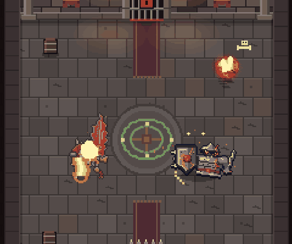

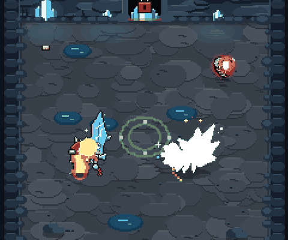 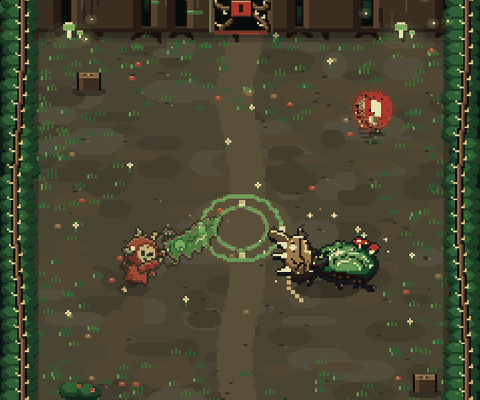

Không đổi tốc độ, vùng trúng hay sát thương của đạn (có bài kiểm tra so đường bay khi có vẽ và khi không vẽ: giống hệt). Hình đạn được vẽ sẵn một lần cho mỗi hướng rồi dán lại, nên nhiều đạn vẫn nhẹ: cảnh đông quái trong `tests/perf.py` chỉ chậm hơn bản trước 3% (trường hợp chậm nhất 12%; giới hạn cho phép là 20%); 60 viên đạn bay cùng lúc vẫn dưới 8 ms mỗi khung.

## B. Hiển thị linh khí

### 1. Trong trận: ba vạch dưới hai ô vũ khí

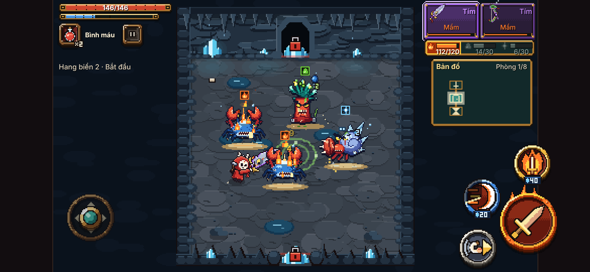

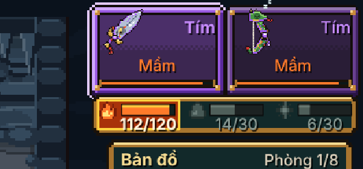

- Ba ô Lửa, Độc, Băng, mỗi ô có biểu tượng hệ, vạch tiến độ tới mốc kế và số (ví dụ "112/120").
- Hệ chính (hệ vũ khí đã khoá) có nền màu hệ, viền sáng; hai hệ còn lại mờ đi. Vũ khí chưa khoá hệ thì cả ba đều sáng, mốc kế là 30.
- Vạch đọc vũ khí đang cầm; đổi vũ khí thì vạch đổi theo.
- Kết liễu quái đang dính hiệu ứng: hạt sáng bay từ quái vào đúng vạch của hệ đó, vạch chớp trắng, chữ "+1 Lửa" hiện ngay cạnh.
- Sắp đạt mốc (còn khoảng một phần tám đoạn) thì vạch nhấp nháy.
- Tấm vạch nằm trên mặt tường sau, cùng kiểu khung trống đồng; bản đồ nhỏ dời xuống một chút để nhường chỗ. Không che sàn đánh.

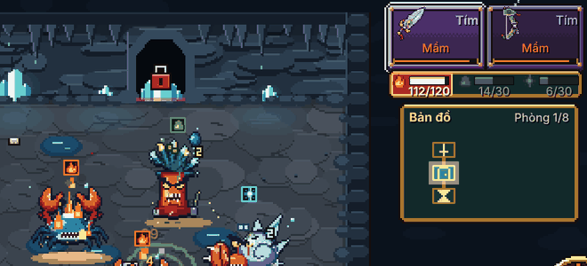 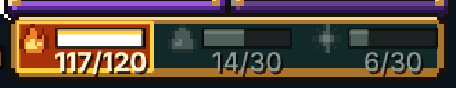

### 2. Biểu tượng hệ trên đầu quái

Quái đang dính hiệu ứng có một biểu tượng hệ nhỏ trên đầu (ô vuông viền màu hệ): kết liễu nó lúc này sẽ được dấu ấn hệ đó. Cách chọn hệ giống hệt luật nhận dấu ấn (hiệu ứng gây sau cùng nếu còn, không thì Lửa, Độc, Băng). Xem ảnh trong trận ở trên.

### 3. Màn kết quả

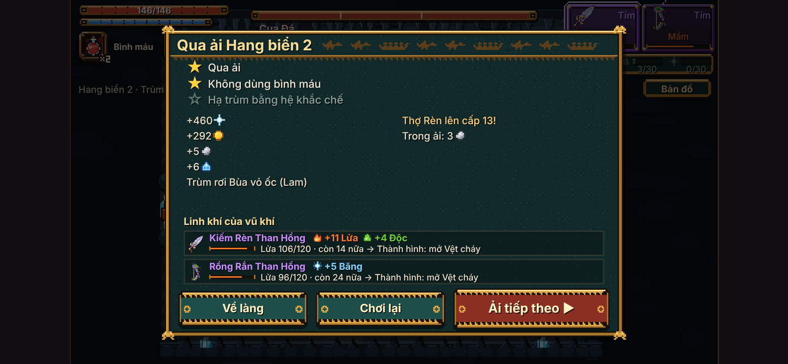

Mỗi vũ khí đang mang một dòng: nhận bao nhiêu dấu ấn từng hệ trong lượt chơi ("+11 Lửa +4 Độc"), tổng hiện tại trên mốc kế ("Lửa 106/120"), còn bao nhiêu nữa, mốc kế mở gì ("→ Thành hình: mở Vệt cháy"). Vũ khí bậc Thường đã tới mức tối đa thì ghi "nâng bậc để lên tiếp"; đã qua 300 thì ghi "đã Thức tỉnh". Dòng cũ "Vũ khí nhận N dấu ấn" được thay bằng khối này.

### 4. Xem vũ khí (ở làng, ở Bà Hàng Xén, ở Ông Thợ Rèn)

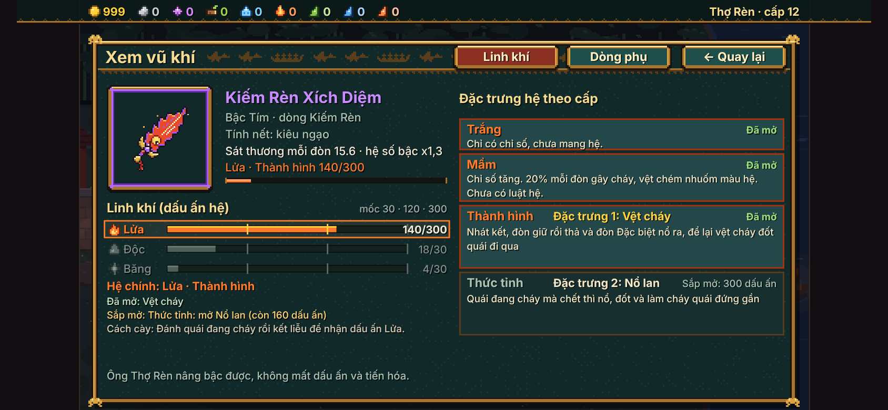

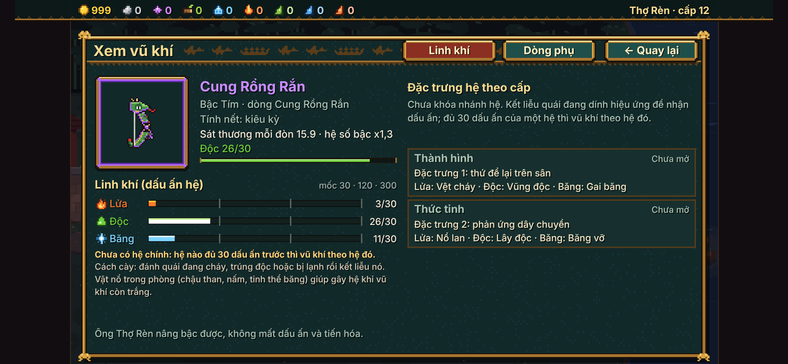

- Màn Xem vũ khí có hai thẻ: **Linh khí** (mở sẵn) và **Dòng phụ** (dòng phụ, dòng mạnh như trước).
- Thẻ Linh khí: ba hàng Lửa, Độc, Băng, mỗi hàng một vạch chia ba đoạn bằng nhau theo mốc 30, 120, 300 (vạch vàng ở mốc đã qua), số hiện tại trên mốc kế; hệ chính có khung màu hệ.
- Bên dưới: hệ chính và mốc đang ở, đặc trưng đã mở, đặc trưng sắp mở và còn bao nhiêu dấu ấn, dòng gợi ý cách cày ("Đánh quái đang cháy rồi kết liễu để nhận dấu ấn Lửa"). Vũ khí chưa khoá hệ thì nói rõ "hệ nào đủ 30 trước thì vũ khí theo hệ đó" và cách gây hệ khi vũ khí còn trắng.
- Ông Thợ Rèn: chọn một vũ khí rồi bấm nút mới **Xem linh khí**.

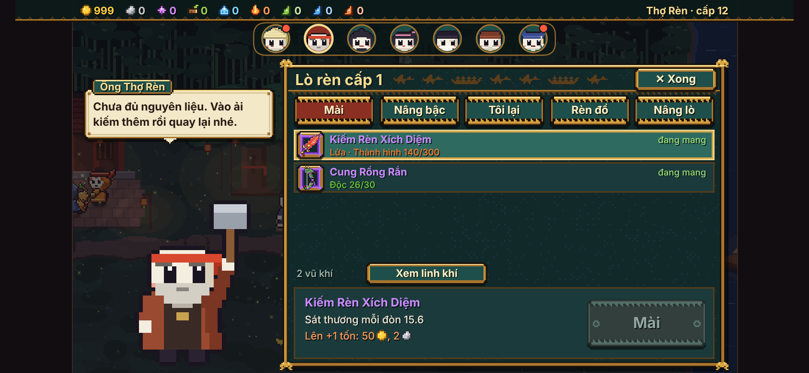

### 5. Trang Linh khí trong hướng dẫn của Cụ Đồ

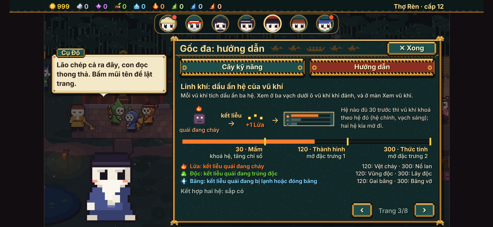

Một trang vẽ bằng hình: quái đang cháy → kết liễu → hạt sáng "+1 Lửa" → tấm vạch; thanh ba mốc 30 Mầm, 120 Thành hình, 300 Thức tỉnh; mỗi hệ nhận dấu ấn thế nào và mở đặc trưng gì; dòng "Kết hợp hai hệ: sắp có".

## Các tệp đã đổi

| Tệp | Việc |
|---|---|
| `game/js/fx_dan.js` (mới) | hình đạn từng loại, vệt, quầng sáng, chớp lúc bắn, toé hạt lúc trúng, cắm tường, vỡ tan |
| `game/js/linhkhi.js` (mới) | ba vạch trong trận, biểu tượng trên đầu quái, khối màn kết quả, bảng Xem vũ khí, trang Cụ Đồ |
| `game/js/fx.js` | hạt dấu ấn bay vào vạch thay vì vào tay em bé, chữ "+1 Lửa" cạnh vạch |
| `game/js/combat.js` | ghi lại mỗi lần nhận dấu ấn (chỉ ghi sổ, không đổi luật) |
| `game/js/stage.js` | gọi vẽ ba vạch, khối linh khí ở màn kết quả |
| `game/js/minimap.js` | bản đồ nhỏ dời xuống 17 điểm nhường chỗ ba vạch |
| `game/js/village.js` | hai thẻ ở Xem vũ khí, nút Xem linh khí ở lò rèn, trang Linh khí ở Cụ Đồ |
| `game/index.html` | nạp hai tệp mới |
| `game/tests/linhkhi.py` (mới) | 36 mục kiểm tra đạn và linh khí |
| `game/tests/dan_linhkhi_shots.py` (mới) | chụp các ảnh và GIF ở trên |

Không đổi: dữ liệu lưu, luật dấu ấn, luật lõi, tốc độ và sát thương của đạn, khoá ngang, giao diện trống đồng, làng, cổng dịch chuyển.

## Kiểm tra

- `tests/linhkhi.py` (mới, 36/36): hình đạn đúng theo vùng; vẽ đạn không đổi đường bay, thời gian bay, sát thương; tên cắm tường, đạn quái vỡ; trúng quái có vòng sóng; 60 viên cùng lúc không lỗi; vạch tăng đúng khi nhận dấu ấn (110 → 111/120, phần đầy dài thêm đúng tỉ lệ); hạt sáng bay về vạch; có chữ "+1 Lửa"; nhấp nháy khi sắp đạt mốc; vạch theo vũ khí đang cầm; biểu tượng trên đầu quái đúng hệ; khoá hệ khi đủ 30; màn kết quả ghi đúng số dấu ấn từng hệ của từng vũ khí, đúng tổng/mốc kế, còn bao nhiêu, mốc kế mở gì; khớp cả ở ải đầu (dấu ấn nhân đôi); Xem vũ khí, lò rèn, Cụ Đồ có đủ chữ.
- Toàn bộ bài cũ chạy lại đều đạt (rules, moves, cung, cong, ghep, ghep2, quai, fx_check, anim_smoke, doors, mapgen, env_rooms, fuzz, smoke, campaign, ui_input cả bốn cỡ màn hình, ui_robust, ui_build).
- Đóng gói `python3 game/build.py`, mở bản trong `game/dist/` không có lỗi trên bảng điều khiển trình duyệt.
- Sau khi gộp phần làm mượt vùng báo trước và phần trang phục (Cô Thợ May) từ nhánh chính: không có chỗ đè nhau phải sửa tay, đã đóng gói lại và chạy lại toàn bộ bài kiểm tra (kể cả `tests/trang_phuc.py` 66/66 và `tests/bao_truoc.py` 21/21): tất cả đạt; ảnh và GIF đã chụp lại.

Ghi chú: phiên này đã chờ phiên làm mượt vùng báo trước xong (dòng "XONG" lúc 02:00) rồi mới tạo nhánh, nên không phải tự gộp phần vẽ hiệu ứng của phiên đó.
