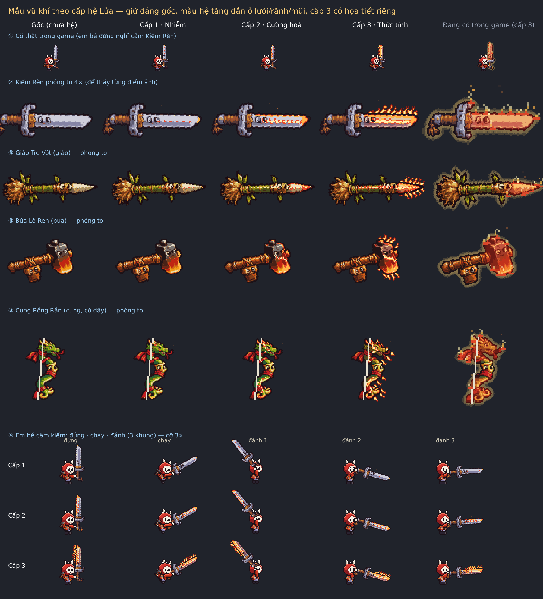
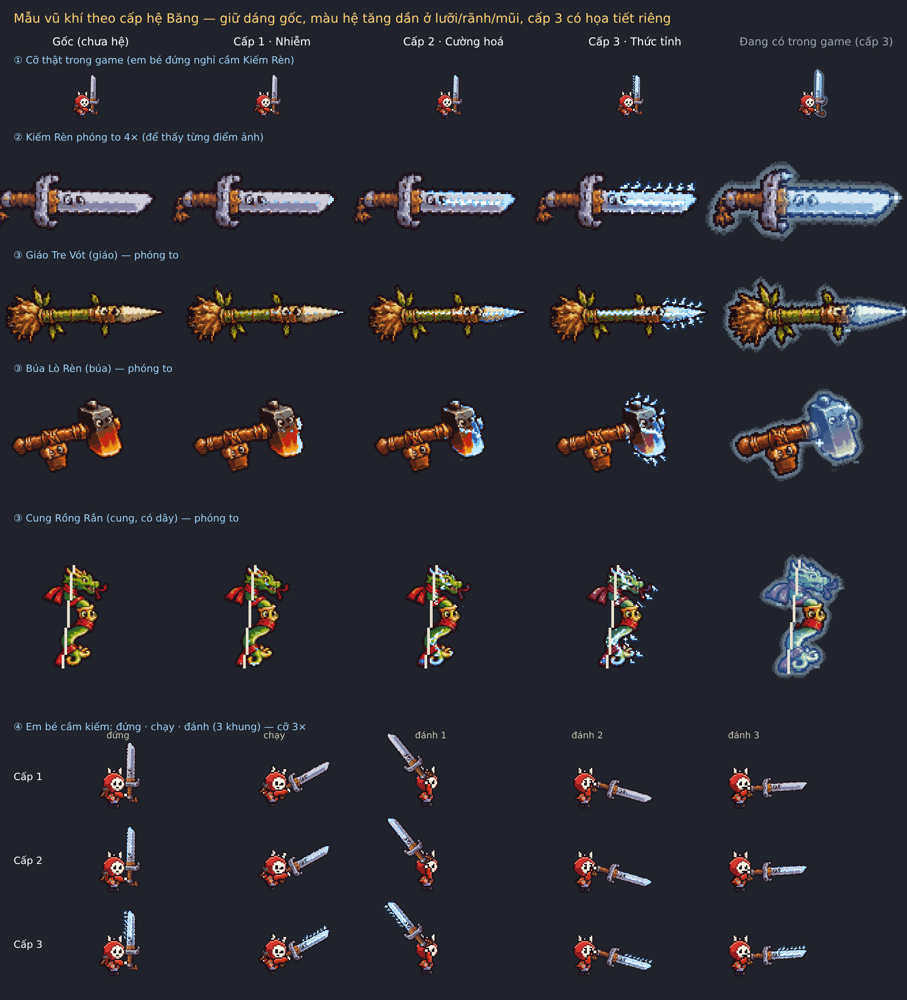
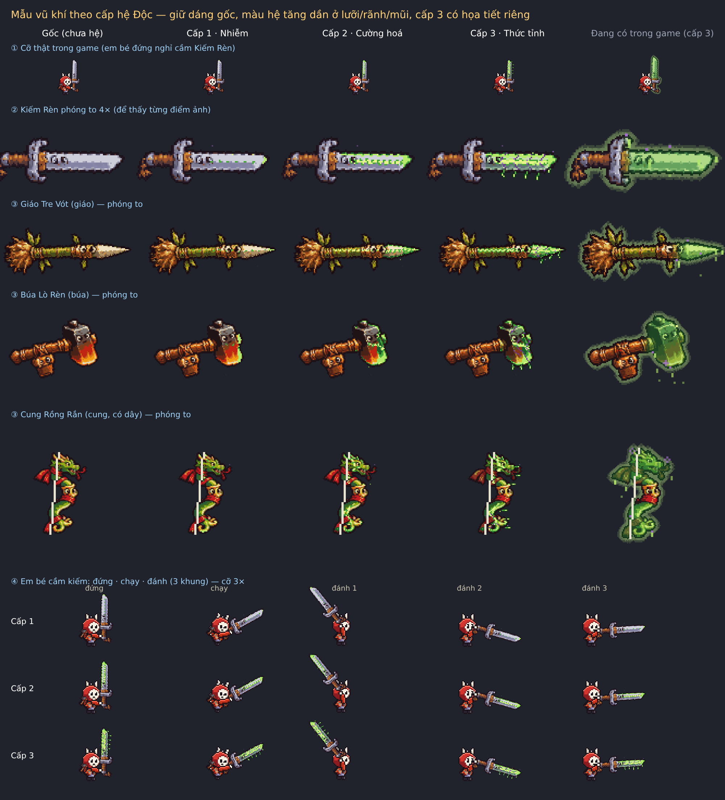

# Báo cáo: mẫu vũ khí đổi hình theo cấp Hệ

**Game chưa thay đổi.** Đây chỉ là bản mẫu để anh xem và duyệt. Duyệt xong, phiên sau mới đưa vào game cho cả 40 vũ khí.

## Làm gì khác bản hiện tại?

Bản đang có trong game: lên hệ là **nhuộm đều cả lưỡi** một màu (đỏ / xanh) và có quầng sáng bao quanh → mất màu kim loại, khó nhận ra món gốc.

Bản mẫu mới:
- **Giữ nguyên** dáng, cán, chuôi, chắn tay, viền, đôi mắt trên vũ khí.
- Màu hệ chỉ đi vào **rãnh giữa, mép lưỡi, đầu mũi** và tăng dần theo cấp.
- **Cấp 1 · Nhiễm**: vài chấm màu hệ trên rãnh, đầu mũi đổi màu, vài điểm sáng.
- **Cấp 2 · Cường hoá**: dải màu hệ dọc mép lưỡi, đường vân năng lượng sáng chạy dọc lưỡi.
- **Cấp 3 · Thức tỉnh**: thêm họa tiết riêng — **Lửa** có ngọn lửa bám mép lưỡi (lay động), **Băng** có tinh thể băng nhọn và sương giá, **Độc** có vân rễ tím và giọt nọc treo.
- Bỏ quầng sáng to → không che em bé.
- Không đổi sát thương, tốc độ, tầm đánh, bản lưu.

## Ảnh mẫu

Mỗi ảnh có: ① cỡ thật cạnh em bé, ② kiếm phóng to, ③ giáo / búa / cung, ④ em bé đứng · chạy · đánh với 3 cấp. Cột cuối (chữ xám) là **bản đang có trong game** để so.

### Lửa

### Băng

### Độc

## Anh cần chọn / duyệt

1. **Hướng chung** có đúng ý không? (giữ màu kim loại, màu hệ chỉ ở rãnh–mép–mũi)
2. **Cấp 3 đủ mạnh chưa?** Nếu muốn rõ hơn: cho thân lưỡi ửng màu hệ nhiều hơn (hiện 35%) hoặc ngọn lửa / tinh thể to hơn.
3. **Cấp 1 có quá nhẹ không?** Ở cỡ thật, cấp 1 chỉ thấy đầu mũi và vài chấm. Có thể làm đậm thêm một chút.
4. **Búa và cung** chưa chỉnh riêng nhiều (búa Lò Rèn vốn đã có lửa trong ảnh gốc; cung có họa tiết ở mặt lưng cung, dây vẫn giữ). Có cần chỉnh riêng thêm không?
5. Muốn **giữ lại quầng sáng nhẹ** ở cấp 3 như bản cũ không? (mẫu mới đã bỏ)

Anh chỉ cần trả lời "duyệt" hoặc ghi số mục muốn sửa. Phiên sau sẽ đưa vào game cho cả 4 loại × 10 dòng × 3 hệ.

## Tệp trong phiên này
- `docs/review/vk-cap-he/phuong-an.md` — phương án kỹ thuật (chỗ code, cách tìm vùng lưỡi, bảng màu, cấu hình).
- `tools/vk-cap-he/cap_he.js` — code mẫu (sẵn để chép vào game).
- `tools/vk-cap-he/tao_anh.js` — script tạo 3 ảnh mẫu.
