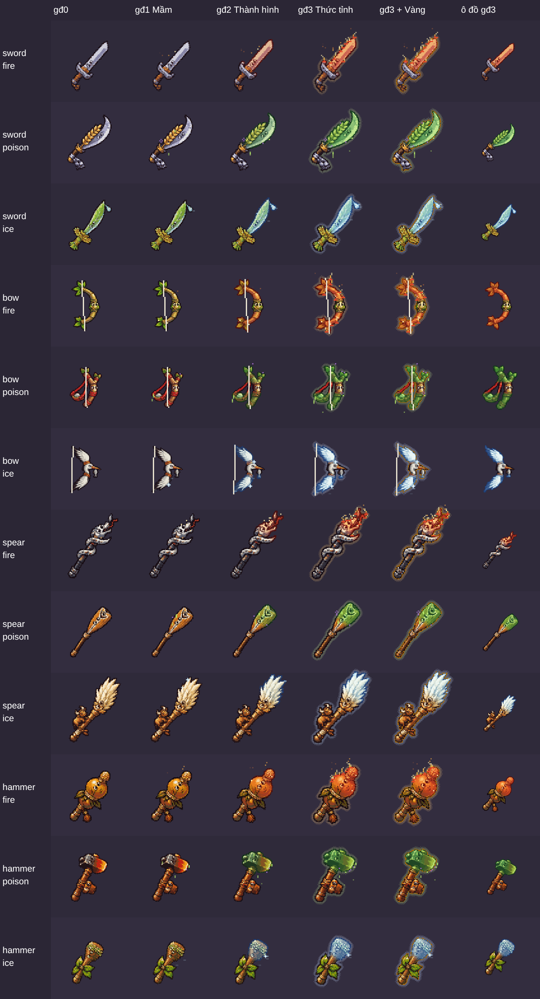

# Vũ khí ảnh AI lại biến đổi theo hệ Lửa / Độc / Băng

## Nguyên nhân

Game vừa thay 40 vũ khí bằng ảnh AI. Mỗi món chỉ có MỘT ảnh (bản thường). Trước đây, vũ khí vẽ bằng code tự đổi hình khi lên hệ (Mầm → Thành hình → Thức tỉnh: đổi màu lưỡi, viền, to hơn, có hiệu ứng). Khi có ảnh AI, game dùng thẳng ảnh đó cho mọi giai đoạn, nên **vũ khí Lửa/Độc/Băng trông y như vũ khí thường**.

## Đã làm

### A. Trong game (đã đăng lên https://spiritblade.web.app)

Khi vũ khí ảnh AI đã lên hệ mà chưa có ảnh riêng cho hệ đó, game tự biến đổi ảnh:

| Giai đoạn | Lửa | Độc | Băng |
|---|---|---|---|
| 1 · Mầm | giữ màu gốc, tàn lửa nhỏ bay lên, lập loè | giữ màu gốc, giọt nọc rơi, bọt nổi | giữ màu gốc, lấp lánh, hơi sương |
| 2 · Thành hình | lưỡi nhuộm đỏ cam (45%), viền đỏ sẫm, nhiều tàn lửa hơn | lưỡi nhuộm xanh độc, viền xanh rêu | lưỡi nhuộm xanh băng, viền xanh đậm |
| 3 · Thức tỉnh | nhuộm đậm (70%), quầng sáng, **ngọn lửa liếm dọc lưỡi** | nhuộm đậm, quầng sáng xanh, giọt dày | nhuộm đậm, quầng sáng lạnh, lấp lánh dày |

- Phần cán gần tay cầm không nhuộm. Cung chỉ nhuộm cánh cung, dây cung giữ nguyên.
- Viền bậc Lam / Tím / Vàng vẫn hiện như cũ.
- Ô đồ (Hành trang) cũng nhuộm theo hệ.
- Hiệu ứng là vài chấm điểm ảnh vẽ mỗi khung, nhẹ cho điện thoại.
- Nếu sau này có ảnh hệ riêng (tệp `vk-<loại>-<dòng>-fire.sprite.json`...), game dùng ảnh đó và chỉ thêm hiệu ứng theo giai đoạn.
- Không đổi sát thương, lối chơi, tên vũ khí. Không đụng đăng nhập, lưu mây.

Ảnh kiểm tra (4 loại × 3 hệ × giai đoạn 0–3, thêm cột bậc Vàng và ô đồ):



### B. Công cụ Tách Đồ (https://spiritblade.web.app/tach-do.html)

Thêm 12 lô mới ở cuối danh sách: **"Vũ khí · Kiếm · hệ Lửa"**, ... **"Vũ khí · Búa · hệ Băng"**.

- Nút **"Sao chép prompt vẽ"** cho prompt riêng của hệ.
- Nút **"Lấy ảnh bản thường của lô"**: công cụ tự lấy 10 vũ khí AI đang có trong game, xếp thành lưới 5×2 đúng nền. Chạm giữ ảnh để lưu vào máy.
- Công cụ tự đặt điểm cầm, mũi, dây cung **giống hệt bản thường cùng dòng**. Có thể thả thêm tệp bản thường (.sprite.json hoặc .zip) nếu muốn.
- Tệp tải về tên `vk-<loại>-<dòng>-fire|poison|ice.sprite.json`, vẫn có 2 bản (gấp đôi + thường) như cũ.

## Cách dùng (trên iPhone)

1. Mở https://spiritblade.web.app/tach-do.html, chọn lô, ví dụ "Vũ khí · Kiếm · hệ Lửa".
2. Bấm **"Lấy ảnh bản thường của lô"** → chạm giữ ảnh → Lưu vào Ảnh.
3. Bấm **"Sao chép prompt vẽ"**. Mở ChatGPT, **gửi kèm ảnh vừa lưu** và dán prompt.
4. Lưu ảnh ChatGPT vẽ, đưa vào bước 2 của công cụ, kiểm tra rồi bấm "Tải tất cả (.zip)".
5. Gửi tệp zip vào dự án như các lần nạp vũ khí AI trước (thư mục `game/art/custom/`).

## PROMPT

Mỗi prompt dùng kèm ảnh bản thường của đúng lô đó (bước 2 ở trên).

### Vũ khí · Kiếm · hệ Lửa (10 món)

```
TÔI GỬI KÈM MỘT TẤM ẢNH: lưới 5 cột × 2 hàng gồm 10 kiếm bản thường của game Linh Khí (pixel art 2D, cảm hứng dân gian Việt Nam). Hãy dùng công cụ tạo ảnh vẽ lại MỘT tấm ảnh mới gồm ĐÚNG 10 món đó: giữ Y HỆT dáng, cỡ, hướng, vị trí trong ô, đôi mắt và thứ tự của từng món như ảnh gửi kèm, CHỈ ĐỔI sang hệ LỬA: lưỡi/thân đổi sang màu đỏ cam như sắt vừa nung (#8a1c12, #e8492a, #ffb347), có vân lửa chạy dọc lưỡi, vài ngọn lửa nhỏ bám sát mép lưỡi (dính liền vào món, không bay rời), viền tối đổi sang đỏ sẫm #4a1010. Phần cán, chuôi gần tay cầm giữ màu gần như cũ. Thứ tự đọc từ trái sang phải, hết hàng trên mới xuống hàng dưới: ô 1: Kiếm Rèn hệ Lửa; ô 2: Đao Lưỡi Liềm hệ Lửa; ô 3: Kiếm Lá Lúa hệ Lửa; ô 4: Gươm Rồng hệ Lửa; ô 5: Mã Tấu hệ Lửa; ô 6: Dao Rựa hệ Lửa; ô 7: Kiếm Tre hệ Lửa; ô 8: Đoản Kiếm Đông Sơn hệ Lửa; ô 9: Đao Cá Chép hệ Lửa; ô 10: Kiếm Sóng Nước hệ Lửa. BỐ CỤC: lưới ĐỀU đúng 5 cột × 2 hàng = 10 ô như ảnh gửi kèm (KHÔNG thêm cột, KHÔNG thêm hàng), kẻ lưới mảnh màu tối, mỗi ô đúng MỘT món. Món NẰM NGANG như ảnh gửi kèm: chuôi bên TRÁI, mũi bên PHẢI. CỠ TRONG Ô: mỗi món chiếm khoảng 70% ô, nằm giữa ô, nằm TRỌN trong ô, không lấn sang ô bên cạnh. KIỂU VẼ: pixel art, màu phẳng, đổ bóng 3 sắc, viền tối một nét quanh mép; hiệu ứng hệ (lửa, giọt, băng) phải dính liền vào món, không bay rời xa. KHÔNG vẽ: chữ, số, nhãn, tên món, bảng phụ, bảng màu, mặt đất, bóng dưới vật, tia lửa hay khói bay rời, ô chỉ có hiệu ứng. Nền trơn MỘT MÀU XANH LÁ #00FF00 phủ kín mọi ô (không ô cờ, không nền trắng, không chuyển màu), không dùng màu nền này trong món đồ. Chỉ cần gửi tấm ảnh, không cần code.
```

### Vũ khí · Kiếm · hệ Độc (10 món)

```
TÔI GỬI KÈM MỘT TẤM ẢNH: lưới 5 cột × 2 hàng gồm 10 kiếm bản thường của game Linh Khí (pixel art 2D, cảm hứng dân gian Việt Nam). Hãy dùng công cụ tạo ảnh vẽ lại MỘT tấm ảnh mới gồm ĐÚNG 10 món đó: giữ Y HỆT dáng, cỡ, hướng, vị trí trong ô, đôi mắt và thứ tự của từng món như ảnh gửi kèm, CHỈ ĐỔI sang hệ ĐỘC: lưỡi/thân đổi sang màu xanh lá độc pha tím (#1d5a2a, #49a83c, #b5ea6a và tím #6b3a8f), có rêu mốc bám, vài giọt nọc xanh đang nhỏ xuống (dính liền vào món), viền tối đổi sang xanh rêu sẫm #12331a. Phần cán, chuôi gần tay cầm giữ màu gần như cũ. Thứ tự đọc từ trái sang phải, hết hàng trên mới xuống hàng dưới: ô 1: Kiếm Rèn hệ Độc; ô 2: Đao Lưỡi Liềm hệ Độc; ô 3: Kiếm Lá Lúa hệ Độc; ô 4: Gươm Rồng hệ Độc; ô 5: Mã Tấu hệ Độc; ô 6: Dao Rựa hệ Độc; ô 7: Kiếm Tre hệ Độc; ô 8: Đoản Kiếm Đông Sơn hệ Độc; ô 9: Đao Cá Chép hệ Độc; ô 10: Kiếm Sóng Nước hệ Độc. BỐ CỤC: lưới ĐỀU đúng 5 cột × 2 hàng = 10 ô như ảnh gửi kèm (KHÔNG thêm cột, KHÔNG thêm hàng), kẻ lưới mảnh màu tối, mỗi ô đúng MỘT món. Món NẰM NGANG như ảnh gửi kèm: chuôi bên TRÁI, mũi bên PHẢI. CỠ TRONG Ô: mỗi món chiếm khoảng 70% ô, nằm giữa ô, nằm TRỌN trong ô, không lấn sang ô bên cạnh. KIỂU VẼ: pixel art, màu phẳng, đổ bóng 3 sắc, viền tối một nét quanh mép; hiệu ứng hệ (lửa, giọt, băng) phải dính liền vào món, không bay rời xa. KHÔNG vẽ: chữ, số, nhãn, tên món, bảng phụ, bảng màu, mặt đất, bóng dưới vật, tia lửa hay khói bay rời, ô chỉ có hiệu ứng. Nền trơn MỘT MÀU HỒNG TÍM #FF00FF phủ kín mọi ô (không ô cờ, không nền trắng, không chuyển màu), không dùng màu nền này trong món đồ. Chỉ cần gửi tấm ảnh, không cần code.
```

### Vũ khí · Kiếm · hệ Băng (10 món)

```
TÔI GỬI KÈM MỘT TẤM ẢNH: lưới 5 cột × 2 hàng gồm 10 kiếm bản thường của game Linh Khí (pixel art 2D, cảm hứng dân gian Việt Nam). Hãy dùng công cụ tạo ảnh vẽ lại MỘT tấm ảnh mới gồm ĐÚNG 10 món đó: giữ Y HỆT dáng, cỡ, hướng, vị trí trong ô, đôi mắt và thứ tự của từng món như ảnh gửi kèm, CHỈ ĐỔI sang hệ BĂNG: lưỡi/thân đổi sang màu xanh băng và trắng (#2f62ad, #7fc4f2, #eafcff), có tinh thể băng nhọn bám dọc lưỡi, lớp sương giá trắng phủ mép (dính liền vào món), viền tối đổi sang xanh đậm #1c3a70. Phần cán, chuôi gần tay cầm giữ màu gần như cũ. Thứ tự đọc từ trái sang phải, hết hàng trên mới xuống hàng dưới: ô 1: Kiếm Rèn hệ Băng; ô 2: Đao Lưỡi Liềm hệ Băng; ô 3: Kiếm Lá Lúa hệ Băng; ô 4: Gươm Rồng hệ Băng; ô 5: Mã Tấu hệ Băng; ô 6: Dao Rựa hệ Băng; ô 7: Kiếm Tre hệ Băng; ô 8: Đoản Kiếm Đông Sơn hệ Băng; ô 9: Đao Cá Chép hệ Băng; ô 10: Kiếm Sóng Nước hệ Băng. BỐ CỤC: lưới ĐỀU đúng 5 cột × 2 hàng = 10 ô như ảnh gửi kèm (KHÔNG thêm cột, KHÔNG thêm hàng), kẻ lưới mảnh màu tối, mỗi ô đúng MỘT món. Món NẰM NGANG như ảnh gửi kèm: chuôi bên TRÁI, mũi bên PHẢI. CỠ TRONG Ô: mỗi món chiếm khoảng 70% ô, nằm giữa ô, nằm TRỌN trong ô, không lấn sang ô bên cạnh. KIỂU VẼ: pixel art, màu phẳng, đổ bóng 3 sắc, viền tối một nét quanh mép; hiệu ứng hệ (lửa, giọt, băng) phải dính liền vào món, không bay rời xa. KHÔNG vẽ: chữ, số, nhãn, tên món, bảng phụ, bảng màu, mặt đất, bóng dưới vật, tia lửa hay khói bay rời, ô chỉ có hiệu ứng. Nền trơn MỘT MÀU XANH LÁ #00FF00 phủ kín mọi ô (không ô cờ, không nền trắng, không chuyển màu), không dùng màu nền này trong món đồ. Chỉ cần gửi tấm ảnh, không cần code.
```

### Vũ khí · Cung · hệ Lửa (10 món)

```
TÔI GỬI KÈM MỘT TẤM ẢNH: lưới 5 cột × 2 hàng gồm 10 cung bản thường của game Linh Khí (pixel art 2D, cảm hứng dân gian Việt Nam). Hãy dùng công cụ tạo ảnh vẽ lại MỘT tấm ảnh mới gồm ĐÚNG 10 món đó: giữ Y HỆT dáng, cỡ, hướng, vị trí trong ô, đôi mắt và thứ tự của từng món như ảnh gửi kèm, CHỈ ĐỔI sang hệ LỬA: lưỡi/thân đổi sang màu đỏ cam như sắt vừa nung (#8a1c12, #e8492a, #ffb347), có vân lửa chạy dọc lưỡi, vài ngọn lửa nhỏ bám sát mép lưỡi (dính liền vào món, không bay rời), viền tối đổi sang đỏ sẫm #4a1010. Phần cán, chuôi gần tay cầm giữ màu gần như cũ. Thứ tự đọc từ trái sang phải, hết hàng trên mới xuống hàng dưới: ô 1: Cung Rồng Rắn hệ Lửa; ô 2: Nỏ Thần hệ Lửa; ô 3: Cung Sừng Trâu hệ Lửa; ô 4: Cung Tre hệ Lửa; ô 5: Ná Thun hệ Lửa; ô 6: Cung Cánh Cò hệ Lửa; ô 7: Cung Trăng Khuyết hệ Lửa; ô 8: Cung Đàn Bầu hệ Lửa; ô 9: Cung Xương Cá hệ Lửa; ô 10: Cung Đèn Ông Sao hệ Lửa. BỐ CỤC: lưới ĐỀU đúng 5 cột × 2 hàng = 10 ô như ảnh gửi kèm (KHÔNG thêm cột, KHÔNG thêm hàng), kẻ lưới mảnh màu tối, mỗi ô đúng MỘT món. Cung DỰNG ĐỨNG như ảnh gửi kèm, KHÔNG vẽ dây cung, KHÔNG vẽ mũi tên (game tự vẽ). CỠ TRONG Ô: mỗi món chiếm khoảng 70% ô, nằm giữa ô, nằm TRỌN trong ô, không lấn sang ô bên cạnh. KIỂU VẼ: pixel art, màu phẳng, đổ bóng 3 sắc, viền tối một nét quanh mép; hiệu ứng hệ (lửa, giọt, băng) phải dính liền vào món, không bay rời xa. KHÔNG vẽ: chữ, số, nhãn, tên món, bảng phụ, bảng màu, mặt đất, bóng dưới vật, tia lửa hay khói bay rời, ô chỉ có hiệu ứng. Nền trơn MỘT MÀU XANH LÁ #00FF00 phủ kín mọi ô (không ô cờ, không nền trắng, không chuyển màu), không dùng màu nền này trong món đồ. Chỉ cần gửi tấm ảnh, không cần code.
```

### Vũ khí · Cung · hệ Độc (10 món)

```
TÔI GỬI KÈM MỘT TẤM ẢNH: lưới 5 cột × 2 hàng gồm 10 cung bản thường của game Linh Khí (pixel art 2D, cảm hứng dân gian Việt Nam). Hãy dùng công cụ tạo ảnh vẽ lại MỘT tấm ảnh mới gồm ĐÚNG 10 món đó: giữ Y HỆT dáng, cỡ, hướng, vị trí trong ô, đôi mắt và thứ tự của từng món như ảnh gửi kèm, CHỈ ĐỔI sang hệ ĐỘC: lưỡi/thân đổi sang màu xanh lá độc pha tím (#1d5a2a, #49a83c, #b5ea6a và tím #6b3a8f), có rêu mốc bám, vài giọt nọc xanh đang nhỏ xuống (dính liền vào món), viền tối đổi sang xanh rêu sẫm #12331a. Phần cán, chuôi gần tay cầm giữ màu gần như cũ. Thứ tự đọc từ trái sang phải, hết hàng trên mới xuống hàng dưới: ô 1: Cung Rồng Rắn hệ Độc; ô 2: Nỏ Thần hệ Độc; ô 3: Cung Sừng Trâu hệ Độc; ô 4: Cung Tre hệ Độc; ô 5: Ná Thun hệ Độc; ô 6: Cung Cánh Cò hệ Độc; ô 7: Cung Trăng Khuyết hệ Độc; ô 8: Cung Đàn Bầu hệ Độc; ô 9: Cung Xương Cá hệ Độc; ô 10: Cung Đèn Ông Sao hệ Độc. BỐ CỤC: lưới ĐỀU đúng 5 cột × 2 hàng = 10 ô như ảnh gửi kèm (KHÔNG thêm cột, KHÔNG thêm hàng), kẻ lưới mảnh màu tối, mỗi ô đúng MỘT món. Cung DỰNG ĐỨNG như ảnh gửi kèm, KHÔNG vẽ dây cung, KHÔNG vẽ mũi tên (game tự vẽ). CỠ TRONG Ô: mỗi món chiếm khoảng 70% ô, nằm giữa ô, nằm TRỌN trong ô, không lấn sang ô bên cạnh. KIỂU VẼ: pixel art, màu phẳng, đổ bóng 3 sắc, viền tối một nét quanh mép; hiệu ứng hệ (lửa, giọt, băng) phải dính liền vào món, không bay rời xa. KHÔNG vẽ: chữ, số, nhãn, tên món, bảng phụ, bảng màu, mặt đất, bóng dưới vật, tia lửa hay khói bay rời, ô chỉ có hiệu ứng. Nền trơn MỘT MÀU HỒNG TÍM #FF00FF phủ kín mọi ô (không ô cờ, không nền trắng, không chuyển màu), không dùng màu nền này trong món đồ. Chỉ cần gửi tấm ảnh, không cần code.
```

### Vũ khí · Cung · hệ Băng (10 món)

```
TÔI GỬI KÈM MỘT TẤM ẢNH: lưới 5 cột × 2 hàng gồm 10 cung bản thường của game Linh Khí (pixel art 2D, cảm hứng dân gian Việt Nam). Hãy dùng công cụ tạo ảnh vẽ lại MỘT tấm ảnh mới gồm ĐÚNG 10 món đó: giữ Y HỆT dáng, cỡ, hướng, vị trí trong ô, đôi mắt và thứ tự của từng món như ảnh gửi kèm, CHỈ ĐỔI sang hệ BĂNG: lưỡi/thân đổi sang màu xanh băng và trắng (#2f62ad, #7fc4f2, #eafcff), có tinh thể băng nhọn bám dọc lưỡi, lớp sương giá trắng phủ mép (dính liền vào món), viền tối đổi sang xanh đậm #1c3a70. Phần cán, chuôi gần tay cầm giữ màu gần như cũ. Thứ tự đọc từ trái sang phải, hết hàng trên mới xuống hàng dưới: ô 1: Cung Rồng Rắn hệ Băng; ô 2: Nỏ Thần hệ Băng; ô 3: Cung Sừng Trâu hệ Băng; ô 4: Cung Tre hệ Băng; ô 5: Ná Thun hệ Băng; ô 6: Cung Cánh Cò hệ Băng; ô 7: Cung Trăng Khuyết hệ Băng; ô 8: Cung Đàn Bầu hệ Băng; ô 9: Cung Xương Cá hệ Băng; ô 10: Cung Đèn Ông Sao hệ Băng. BỐ CỤC: lưới ĐỀU đúng 5 cột × 2 hàng = 10 ô như ảnh gửi kèm (KHÔNG thêm cột, KHÔNG thêm hàng), kẻ lưới mảnh màu tối, mỗi ô đúng MỘT món. Cung DỰNG ĐỨNG như ảnh gửi kèm, KHÔNG vẽ dây cung, KHÔNG vẽ mũi tên (game tự vẽ). CỠ TRONG Ô: mỗi món chiếm khoảng 70% ô, nằm giữa ô, nằm TRỌN trong ô, không lấn sang ô bên cạnh. KIỂU VẼ: pixel art, màu phẳng, đổ bóng 3 sắc, viền tối một nét quanh mép; hiệu ứng hệ (lửa, giọt, băng) phải dính liền vào món, không bay rời xa. KHÔNG vẽ: chữ, số, nhãn, tên món, bảng phụ, bảng màu, mặt đất, bóng dưới vật, tia lửa hay khói bay rời, ô chỉ có hiệu ứng. Nền trơn MỘT MÀU XANH LÁ #00FF00 phủ kín mọi ô (không ô cờ, không nền trắng, không chuyển màu), không dùng màu nền này trong món đồ. Chỉ cần gửi tấm ảnh, không cần code.
```

### Vũ khí · Giáo · hệ Lửa (10 món)

```
TÔI GỬI KÈM MỘT TẤM ẢNH: lưới 5 cột × 2 hàng gồm 10 giáo bản thường của game Linh Khí (pixel art 2D, cảm hứng dân gian Việt Nam). Hãy dùng công cụ tạo ảnh vẽ lại MỘT tấm ảnh mới gồm ĐÚNG 10 món đó: giữ Y HỆT dáng, cỡ, hướng, vị trí trong ô, đôi mắt và thứ tự của từng món như ảnh gửi kèm, CHỈ ĐỔI sang hệ LỬA: lưỡi/thân đổi sang màu đỏ cam như sắt vừa nung (#8a1c12, #e8492a, #ffb347), có vân lửa chạy dọc lưỡi, vài ngọn lửa nhỏ bám sát mép lưỡi (dính liền vào món, không bay rời), viền tối đổi sang đỏ sẫm #4a1010. Phần cán, chuôi gần tay cầm giữ màu gần như cũ. Thứ tự đọc từ trái sang phải, hết hàng trên mới xuống hàng dưới: ô 1: Giáo Tre Vót hệ Lửa; ô 2: Đinh Ba hệ Lửa; ô 3: Câu Liêm hệ Lửa; ô 4: Mác hệ Lửa; ô 5: Lao Phóng hệ Lửa; ô 6: Giáo Đồng Đông Sơn hệ Lửa; ô 7: Xà Mâu hệ Lửa; ô 8: Mái Chèo hệ Lửa; ô 9: Cờ Lau hệ Lửa; ô 10: Bút Lông hệ Lửa. BỐ CỤC: lưới ĐỀU đúng 5 cột × 2 hàng = 10 ô như ảnh gửi kèm (KHÔNG thêm cột, KHÔNG thêm hàng), kẻ lưới mảnh màu tối, mỗi ô đúng MỘT món. Món NẰM NGANG như ảnh gửi kèm: chuôi bên TRÁI, mũi bên PHẢI. CỠ TRONG Ô: mỗi món chiếm khoảng 70% ô, nằm giữa ô, nằm TRỌN trong ô, không lấn sang ô bên cạnh. KIỂU VẼ: pixel art, màu phẳng, đổ bóng 3 sắc, viền tối một nét quanh mép; hiệu ứng hệ (lửa, giọt, băng) phải dính liền vào món, không bay rời xa. KHÔNG vẽ: chữ, số, nhãn, tên món, bảng phụ, bảng màu, mặt đất, bóng dưới vật, tia lửa hay khói bay rời, ô chỉ có hiệu ứng. Nền trơn MỘT MÀU XANH LÁ #00FF00 phủ kín mọi ô (không ô cờ, không nền trắng, không chuyển màu), không dùng màu nền này trong món đồ. Chỉ cần gửi tấm ảnh, không cần code.
```

### Vũ khí · Giáo · hệ Độc (10 món)

```
TÔI GỬI KÈM MỘT TẤM ẢNH: lưới 5 cột × 2 hàng gồm 10 giáo bản thường của game Linh Khí (pixel art 2D, cảm hứng dân gian Việt Nam). Hãy dùng công cụ tạo ảnh vẽ lại MỘT tấm ảnh mới gồm ĐÚNG 10 món đó: giữ Y HỆT dáng, cỡ, hướng, vị trí trong ô, đôi mắt và thứ tự của từng món như ảnh gửi kèm, CHỈ ĐỔI sang hệ ĐỘC: lưỡi/thân đổi sang màu xanh lá độc pha tím (#1d5a2a, #49a83c, #b5ea6a và tím #6b3a8f), có rêu mốc bám, vài giọt nọc xanh đang nhỏ xuống (dính liền vào món), viền tối đổi sang xanh rêu sẫm #12331a. Phần cán, chuôi gần tay cầm giữ màu gần như cũ. Thứ tự đọc từ trái sang phải, hết hàng trên mới xuống hàng dưới: ô 1: Giáo Tre Vót hệ Độc; ô 2: Đinh Ba hệ Độc; ô 3: Câu Liêm hệ Độc; ô 4: Mác hệ Độc; ô 5: Lao Phóng hệ Độc; ô 6: Giáo Đồng Đông Sơn hệ Độc; ô 7: Xà Mâu hệ Độc; ô 8: Mái Chèo hệ Độc; ô 9: Cờ Lau hệ Độc; ô 10: Bút Lông hệ Độc. BỐ CỤC: lưới ĐỀU đúng 5 cột × 2 hàng = 10 ô như ảnh gửi kèm (KHÔNG thêm cột, KHÔNG thêm hàng), kẻ lưới mảnh màu tối, mỗi ô đúng MỘT món. Món NẰM NGANG như ảnh gửi kèm: chuôi bên TRÁI, mũi bên PHẢI. CỠ TRONG Ô: mỗi món chiếm khoảng 70% ô, nằm giữa ô, nằm TRỌN trong ô, không lấn sang ô bên cạnh. KIỂU VẼ: pixel art, màu phẳng, đổ bóng 3 sắc, viền tối một nét quanh mép; hiệu ứng hệ (lửa, giọt, băng) phải dính liền vào món, không bay rời xa. KHÔNG vẽ: chữ, số, nhãn, tên món, bảng phụ, bảng màu, mặt đất, bóng dưới vật, tia lửa hay khói bay rời, ô chỉ có hiệu ứng. Nền trơn MỘT MÀU HỒNG TÍM #FF00FF phủ kín mọi ô (không ô cờ, không nền trắng, không chuyển màu), không dùng màu nền này trong món đồ. Chỉ cần gửi tấm ảnh, không cần code.
```

### Vũ khí · Giáo · hệ Băng (10 món)

```
TÔI GỬI KÈM MỘT TẤM ẢNH: lưới 5 cột × 2 hàng gồm 10 giáo bản thường của game Linh Khí (pixel art 2D, cảm hứng dân gian Việt Nam). Hãy dùng công cụ tạo ảnh vẽ lại MỘT tấm ảnh mới gồm ĐÚNG 10 món đó: giữ Y HỆT dáng, cỡ, hướng, vị trí trong ô, đôi mắt và thứ tự của từng món như ảnh gửi kèm, CHỈ ĐỔI sang hệ BĂNG: lưỡi/thân đổi sang màu xanh băng và trắng (#2f62ad, #7fc4f2, #eafcff), có tinh thể băng nhọn bám dọc lưỡi, lớp sương giá trắng phủ mép (dính liền vào món), viền tối đổi sang xanh đậm #1c3a70. Phần cán, chuôi gần tay cầm giữ màu gần như cũ. Thứ tự đọc từ trái sang phải, hết hàng trên mới xuống hàng dưới: ô 1: Giáo Tre Vót hệ Băng; ô 2: Đinh Ba hệ Băng; ô 3: Câu Liêm hệ Băng; ô 4: Mác hệ Băng; ô 5: Lao Phóng hệ Băng; ô 6: Giáo Đồng Đông Sơn hệ Băng; ô 7: Xà Mâu hệ Băng; ô 8: Mái Chèo hệ Băng; ô 9: Cờ Lau hệ Băng; ô 10: Bút Lông hệ Băng. BỐ CỤC: lưới ĐỀU đúng 5 cột × 2 hàng = 10 ô như ảnh gửi kèm (KHÔNG thêm cột, KHÔNG thêm hàng), kẻ lưới mảnh màu tối, mỗi ô đúng MỘT món. Món NẰM NGANG như ảnh gửi kèm: chuôi bên TRÁI, mũi bên PHẢI. CỠ TRONG Ô: mỗi món chiếm khoảng 70% ô, nằm giữa ô, nằm TRỌN trong ô, không lấn sang ô bên cạnh. KIỂU VẼ: pixel art, màu phẳng, đổ bóng 3 sắc, viền tối một nét quanh mép; hiệu ứng hệ (lửa, giọt, băng) phải dính liền vào món, không bay rời xa. KHÔNG vẽ: chữ, số, nhãn, tên món, bảng phụ, bảng màu, mặt đất, bóng dưới vật, tia lửa hay khói bay rời, ô chỉ có hiệu ứng. Nền trơn MỘT MÀU XANH LÁ #00FF00 phủ kín mọi ô (không ô cờ, không nền trắng, không chuyển màu), không dùng màu nền này trong món đồ. Chỉ cần gửi tấm ảnh, không cần code.
```

### Vũ khí · Búa · hệ Lửa (10 món)

```
TÔI GỬI KÈM MỘT TẤM ẢNH: lưới 5 cột × 2 hàng gồm 10 búa bản thường của game Linh Khí (pixel art 2D, cảm hứng dân gian Việt Nam). Hãy dùng công cụ tạo ảnh vẽ lại MỘT tấm ảnh mới gồm ĐÚNG 10 món đó: giữ Y HỆT dáng, cỡ, hướng, vị trí trong ô, đôi mắt và thứ tự của từng món như ảnh gửi kèm, CHỈ ĐỔI sang hệ LỬA: lưỡi/thân đổi sang màu đỏ cam như sắt vừa nung (#8a1c12, #e8492a, #ffb347), có vân lửa chạy dọc lưỡi, vài ngọn lửa nhỏ bám sát mép lưỡi (dính liền vào món, không bay rời), viền tối đổi sang đỏ sẫm #4a1010. Phần cán, chuôi gần tay cầm giữ màu gần như cũ. Thứ tự đọc từ trái sang phải, hết hàng trên mới xuống hàng dưới: ô 1: Búa Lò Rèn hệ Lửa; ô 2: Chày Giã Gạo hệ Lửa; ô 3: Chùy Gai hệ Lửa; ô 4: Rìu Đá hệ Lửa; ô 5: Vồ Gỗ hệ Lửa; ô 6: Chiêng Đồng hệ Lửa; ô 7: Trống Đồng hệ Lửa; ô 8: Rìu Xéo Đông Sơn hệ Lửa; ô 9: Búa Đầu Trâu hệ Lửa; ô 10: Chùy Hồ Lô hệ Lửa. BỐ CỤC: lưới ĐỀU đúng 5 cột × 2 hàng = 10 ô như ảnh gửi kèm (KHÔNG thêm cột, KHÔNG thêm hàng), kẻ lưới mảnh màu tối, mỗi ô đúng MỘT món. Món NẰM NGANG như ảnh gửi kèm: chuôi bên TRÁI, mũi bên PHẢI. CỠ TRONG Ô: mỗi món chiếm khoảng 70% ô, nằm giữa ô, nằm TRỌN trong ô, không lấn sang ô bên cạnh. KIỂU VẼ: pixel art, màu phẳng, đổ bóng 3 sắc, viền tối một nét quanh mép; hiệu ứng hệ (lửa, giọt, băng) phải dính liền vào món, không bay rời xa. KHÔNG vẽ: chữ, số, nhãn, tên món, bảng phụ, bảng màu, mặt đất, bóng dưới vật, tia lửa hay khói bay rời, ô chỉ có hiệu ứng. Nền trơn MỘT MÀU XANH LÁ #00FF00 phủ kín mọi ô (không ô cờ, không nền trắng, không chuyển màu), không dùng màu nền này trong món đồ. Chỉ cần gửi tấm ảnh, không cần code.
```

### Vũ khí · Búa · hệ Độc (10 món)

```
TÔI GỬI KÈM MỘT TẤM ẢNH: lưới 5 cột × 2 hàng gồm 10 búa bản thường của game Linh Khí (pixel art 2D, cảm hứng dân gian Việt Nam). Hãy dùng công cụ tạo ảnh vẽ lại MỘT tấm ảnh mới gồm ĐÚNG 10 món đó: giữ Y HỆT dáng, cỡ, hướng, vị trí trong ô, đôi mắt và thứ tự của từng món như ảnh gửi kèm, CHỈ ĐỔI sang hệ ĐỘC: lưỡi/thân đổi sang màu xanh lá độc pha tím (#1d5a2a, #49a83c, #b5ea6a và tím #6b3a8f), có rêu mốc bám, vài giọt nọc xanh đang nhỏ xuống (dính liền vào món), viền tối đổi sang xanh rêu sẫm #12331a. Phần cán, chuôi gần tay cầm giữ màu gần như cũ. Thứ tự đọc từ trái sang phải, hết hàng trên mới xuống hàng dưới: ô 1: Búa Lò Rèn hệ Độc; ô 2: Chày Giã Gạo hệ Độc; ô 3: Chùy Gai hệ Độc; ô 4: Rìu Đá hệ Độc; ô 5: Vồ Gỗ hệ Độc; ô 6: Chiêng Đồng hệ Độc; ô 7: Trống Đồng hệ Độc; ô 8: Rìu Xéo Đông Sơn hệ Độc; ô 9: Búa Đầu Trâu hệ Độc; ô 10: Chùy Hồ Lô hệ Độc. BỐ CỤC: lưới ĐỀU đúng 5 cột × 2 hàng = 10 ô như ảnh gửi kèm (KHÔNG thêm cột, KHÔNG thêm hàng), kẻ lưới mảnh màu tối, mỗi ô đúng MỘT món. Món NẰM NGANG như ảnh gửi kèm: chuôi bên TRÁI, mũi bên PHẢI. CỠ TRONG Ô: mỗi món chiếm khoảng 70% ô, nằm giữa ô, nằm TRỌN trong ô, không lấn sang ô bên cạnh. KIỂU VẼ: pixel art, màu phẳng, đổ bóng 3 sắc, viền tối một nét quanh mép; hiệu ứng hệ (lửa, giọt, băng) phải dính liền vào món, không bay rời xa. KHÔNG vẽ: chữ, số, nhãn, tên món, bảng phụ, bảng màu, mặt đất, bóng dưới vật, tia lửa hay khói bay rời, ô chỉ có hiệu ứng. Nền trơn MỘT MÀU HỒNG TÍM #FF00FF phủ kín mọi ô (không ô cờ, không nền trắng, không chuyển màu), không dùng màu nền này trong món đồ. Chỉ cần gửi tấm ảnh, không cần code.
```

### Vũ khí · Búa · hệ Băng (10 món)

```
TÔI GỬI KÈM MỘT TẤM ẢNH: lưới 5 cột × 2 hàng gồm 10 búa bản thường của game Linh Khí (pixel art 2D, cảm hứng dân gian Việt Nam). Hãy dùng công cụ tạo ảnh vẽ lại MỘT tấm ảnh mới gồm ĐÚNG 10 món đó: giữ Y HỆT dáng, cỡ, hướng, vị trí trong ô, đôi mắt và thứ tự của từng món như ảnh gửi kèm, CHỈ ĐỔI sang hệ BĂNG: lưỡi/thân đổi sang màu xanh băng và trắng (#2f62ad, #7fc4f2, #eafcff), có tinh thể băng nhọn bám dọc lưỡi, lớp sương giá trắng phủ mép (dính liền vào món), viền tối đổi sang xanh đậm #1c3a70. Phần cán, chuôi gần tay cầm giữ màu gần như cũ. Thứ tự đọc từ trái sang phải, hết hàng trên mới xuống hàng dưới: ô 1: Búa Lò Rèn hệ Băng; ô 2: Chày Giã Gạo hệ Băng; ô 3: Chùy Gai hệ Băng; ô 4: Rìu Đá hệ Băng; ô 5: Vồ Gỗ hệ Băng; ô 6: Chiêng Đồng hệ Băng; ô 7: Trống Đồng hệ Băng; ô 8: Rìu Xéo Đông Sơn hệ Băng; ô 9: Búa Đầu Trâu hệ Băng; ô 10: Chùy Hồ Lô hệ Băng. BỐ CỤC: lưới ĐỀU đúng 5 cột × 2 hàng = 10 ô như ảnh gửi kèm (KHÔNG thêm cột, KHÔNG thêm hàng), kẻ lưới mảnh màu tối, mỗi ô đúng MỘT món. Món NẰM NGANG như ảnh gửi kèm: chuôi bên TRÁI, mũi bên PHẢI. CỠ TRONG Ô: mỗi món chiếm khoảng 70% ô, nằm giữa ô, nằm TRỌN trong ô, không lấn sang ô bên cạnh. KIỂU VẼ: pixel art, màu phẳng, đổ bóng 3 sắc, viền tối một nét quanh mép; hiệu ứng hệ (lửa, giọt, băng) phải dính liền vào món, không bay rời xa. KHÔNG vẽ: chữ, số, nhãn, tên món, bảng phụ, bảng màu, mặt đất, bóng dưới vật, tia lửa hay khói bay rời, ô chỉ có hiệu ứng. Nền trơn MỘT MÀU XANH LÁ #00FF00 phủ kín mọi ô (không ô cờ, không nền trắng, không chuyển màu), không dùng màu nền này trong món đồ. Chỉ cần gửi tấm ảnh, không cần code.
```
