# Hướng dẫn dùng Xưởng Sprite

Xưởng Sprite là công cụ để **tự vẽ hình quái, em bé, vũ khí, trang phục, đồ và tài nguyên, người làng** cho Linh Khí. Bạn vẽ tay (trên giấy hoặc trên máy), đưa ảnh vào, công cụ biến nó thành hình pixel có đủ động tác, rồi bạn tải tệp về gửi cho Claude để đưa vào game.

- Mở trên web: **https://spiritblade.web.app/xuong-sprite.html** (máy tính hoặc điện thoại cầm ngang). Không cần cài gì.
- Hoặc mở tệp `tools/xuong-sprite/index.html` trong repo.
- Người chơi không thấy công cụ này; game không có nút hay màn nào mới.

## Vẽ thế nào cho đẹp nhất

| Nên | Vì sao |
|---|---|
| **Vẽ trên giấy trắng trơn** (hoặc nền một màu), chụp thẳng, đủ sáng | Công cụ tự xoá nền dễ nhất khi nền sáng đều |
| **Con vật quay mặt sang phải**, nhìn ngang | Mọi động tác được làm cho hình quay phải; game tự lật khi quái quay trái. Lỡ vẽ quay trái thì bật "Hình quay sang trái (lật lại)" |
| **Nét viền đậm, tô màu kín**, ít màu | Hình game rất nhỏ: mảng màu lớn và nét rõ giữ được hình dáng |
| **Tay, chân, đuôi, cánh tách xa thân một chút** | Công cụ chia bộ phận dễ hơn, cử động không bị dính |
| Mắt to, đầu to | Ở cỡ nhỏ chi tiết nhỏ sẽ mất; mắt to vẫn đọc được |
| Không cần vẽ to | Hình game chỉ cao khoảng 25 đến 120 điểm ảnh; ảnh chụp bình thường là đủ |

Cỡ khuyên dùng trong game (công cụ tự đặt theo quái gốc, có thanh chỉnh):

- Quái thường: cao 25 đến 40 điểm ảnh. Tinh anh: 45 đến 65. Trùm nhỏ: 65 đến 70. Trùm vùng: 100 đến 125.
- Em bé: cao khoảng 28 điểm ảnh (cả mũ).

Mẫu ảnh vẽ tay dùng để thử: 

Nhờ AI vẽ thay vì vẽ tay: dùng [PROMPT-VE.md](PROMPT-VE.md) (mỗi hình một dòng, đã ghi sẵn góc nhìn, tỉ lệ, màu, dáng hợp khung) và ảnh hình đang có trong game ở [tham-chieu/](tham-chieu/). Số đo hình trong game: [DAC-DIEM-HINH-GAME.md](DAC-DIEM-HINH-GAME.md).

## Các bước

### 1. Chọn
Trang chọn chia sáu nhóm (hàng nút trên cùng, số bên cạnh là số thẻ): **Em bé · Quái (ba vùng) · Vũ khí · Trang phục · Đồ và tài nguyên · Người làng**. Bấm một nhóm để mở; công cụ nhớ nhóm bạn mở lần trước. Mỗi thẻ có hình nhỏ là hình đang có trong game (vẽ bằng code) để so. Nhóm Quái có thêm **Quái mới** (đặt mã như `rongDat` và tên như `Rồng Đất`). Thẻ có nhãn **Đang làm** là bài còn nháp.

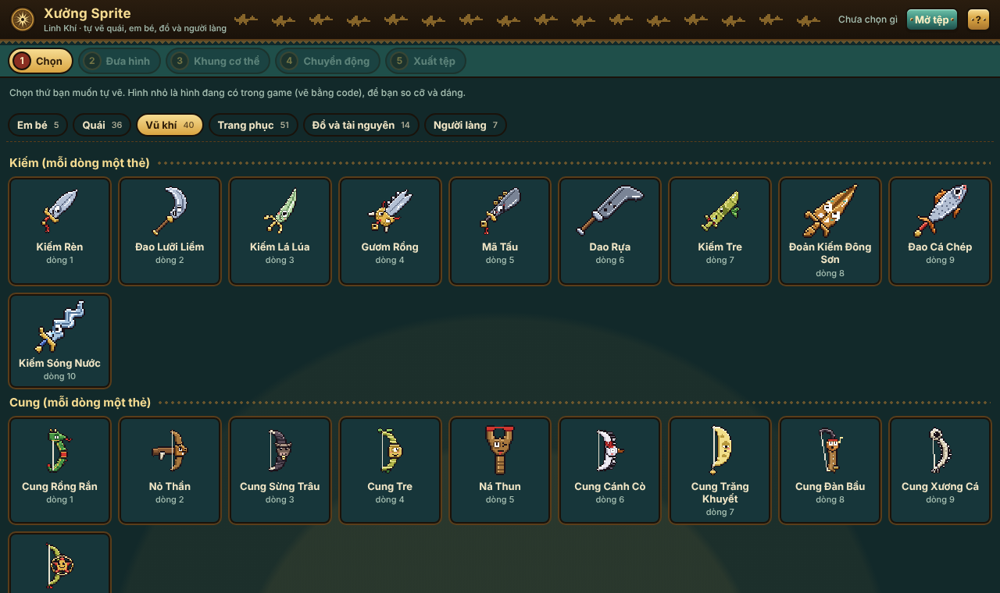

### 2. Đưa hình
Kéo thả ảnh vào khung (hoặc bấm **Chọn ảnh…**). Công cụ tự xoá nền, cắt sát, thu về cỡ game, giảm màu và thêm viền tối.

- **Ngưỡng tách nền**: kéo lên nếu còn sót nền, kéo xuống nếu mất bớt hình.
- **Từ mép vào** giữ chỗ trắng bên trong (mắt, răng). Nếu nền lọt vào giữa hai chân thì chọn **Mọi chỗ cùng màu nền**.
- **Bút giữ lại / Cục tẩy**: tô để sửa tay. Có **Hoàn tác**.
- **Chiều cao trong game**, **Số màu**, **Viền tối 1px**: chỉnh chất pixel. Bấm "Hình pixel trong game" để xem cạnh hình code cùng cỡ.

#### Giữ nét (không làm nhòe chi tiết)
Thu ảnh vẽ to về cỡ game (em bé chỉ cao khoảng 28 điểm ảnh) dễ làm hình mờ. Công cụ có hai **cách thu nhỏ**:

- **Giữ nét** (mặc định): mỗi điểm ảnh game lấy **đúng một màu đã vẽ** (màu chiếm nhiều nhất trong ô đó), không pha trộn ra màu trung gian. Ô nào có nét viền tối thì ưu tiên giữ nét tối, nối chỗ đứt để **viền liền**. Chi tiết nhỏ nổi bật (mắt, chuông, má hồng) được cứu lại nếu xung quanh không còn màu đó.
- **Mềm (kiểu cũ)**: lấy trung bình màu, mịn hơn nhưng nhòe. Tệp làm từ trước tự giữ kiểu này để hình không đổi.

Thêm nữa:

- **Số màu** mặc định 20 (chọn được tới 32). Màu giữ đúng màu gốc, màu khác hẳn nhau (mặt nạ giấy với áo, mắt với da) không bị gộp.
- **Viền tối 1px ở mép ngoài**: chỉ thêm quanh mép ngoài hình, không đè lên chi tiết bên trong. Bỏ dấu để tắt.
- **So sánh cạnh nhau** (tự mở khi vừa đưa ảnh vào): ảnh gốc | cỡ game phóng to thấy từng điểm ảnh | cỡ thật trong phòng game (cạnh em bé gốc). Ở ảnh gốc, **chỗ tô đỏ là chi tiết sẽ mất ở cỡ hiện tại**; dòng chữ bên dưới đếm số mảng mất. Kéo **Chiều cao trong game** để xem chi tiết nào còn, chi tiết nào mất. Muốn giữ một chi tiết thì vẽ nó to hơn, hoặc tăng chiều cao.

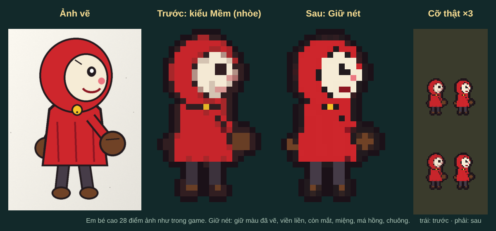
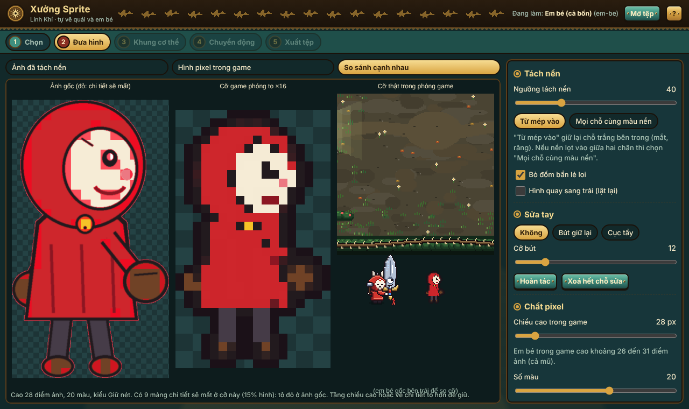

### 3. Khung cơ thể
Chọn mẫu khung (dấu ★ là gợi ý theo cách quái gốc di chuyển): **Người (2 chân)**, **Bốn chân**, **Cua, bọ (nhiều chân)**, **Cá, chim bay**, **Khối mềm (slime, lửa, ma)**, **Rắn**, **Cây, đứng yên**.

Vừa chọn mẫu, công cụ **tự đoán** bộ phận theo hình dáng và màu của hình (không chỉ theo tỉ lệ khung như trước):
phần trên cùng tròn là đầu, chỗ hẹp nhất là cổ, nhánh mỏng hai bên là tay, các mảng tách nhau bởi khe ở đáy là chân,
phần dài phía sau là đuôi. Ảnh nhìn chính diện, tay áp sát thân (kiểu ảnh AI vẽ) thì tay được nhận theo mảng màu riêng sát
mép hai bên (găng, bàn tay, tay áo). Khớp (vai, hông, cổ…) được đặt theo kết quả đoán.

- Bộ phận nào **chưa chắc** thì công cụ để nó **dính thân** (không cử động riêng, không cắt sai) và hiện chữ vàng
  **"Tô thêm cho đúng: …"**, tên bộ phận đó có dấu **?**. Muốn nó cử động thì tô thêm (xem dưới).
- **Kéo khớp**: kéo các chấm tròn vào đúng vai, hông, cổ, gốc đuôi… Hình thoi trắng là điểm chân chạm đất.
  Bấm **Chia theo khớp** để chia lại theo khớp vừa kéo; bấm **Tự đoán bộ phận** để đoán lại từ đầu.
- **Bút tô bộ phận**: chọn bộ phận rồi tô lên hình. **Cục tẩy (trả về thân)**: chỗ tô sai trả về thân.
- Trên điện thoại: kéo thanh **Cỡ bút** (1 đến 10), bấm **×2**, **×3** để phóng to, **✋ Kéo hình** để dời chỗ đang xem,
  **↶ Hoàn tác** để bỏ nét vừa tô.

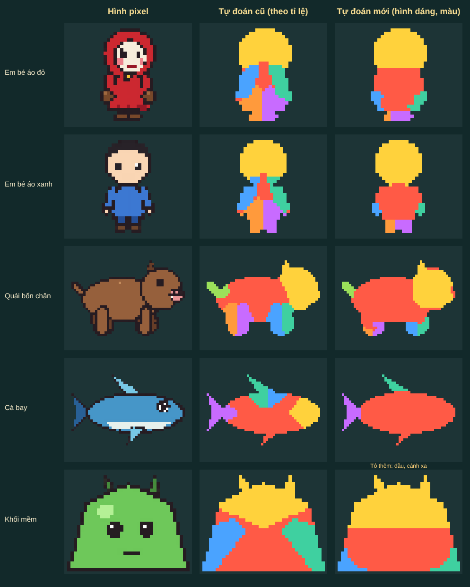

**Không còn vỡ hình khi cử động.** Trước đây khi tay chân xoay, hình hay bị rách ở khớp: lộ lỗ trên thân chỗ tay vừa che,
khe hở ở vai, hông, mảnh bị cắt sai. Bây giờ công cụ tự làm khi dựng từng khung:
lấp sẵn chỗ thân bị tay chân che bằng màu thân xung quanh; mỗi bộ phận lấy dư một mép thân ở khớp để vá khớp;
bộ phận áp sát thân thì xoay ít lại; xoay quanh đúng khớp, lấy điểm gần nhất trên hình phóng to (không răng cưa, không viền
mờ, không màu mới); tay sau vẽ dưới thân, tay trước vẽ trên thân; lỗ nhỏ, khe một điểm mới sinh ra được vá, viền tối liền.
Bên trái là cách cũ, bên phải là bây giờ:

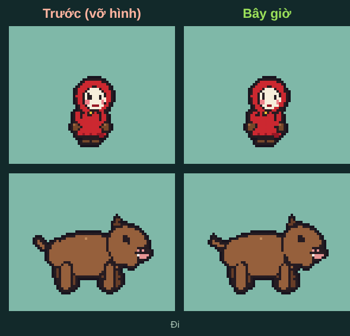

Bộ phận vẽ hơi tách thân (đuôi, tai mảnh, khi thu nhỏ còn cách thân 1 đến 3 điểm ảnh) được tự nối bằng vài điểm nét, nên
không bay rời khi cử động. Khe hẹp 1 điểm giữa tay và thân khi tay xoay ra được tô màu viền thành nét liền.

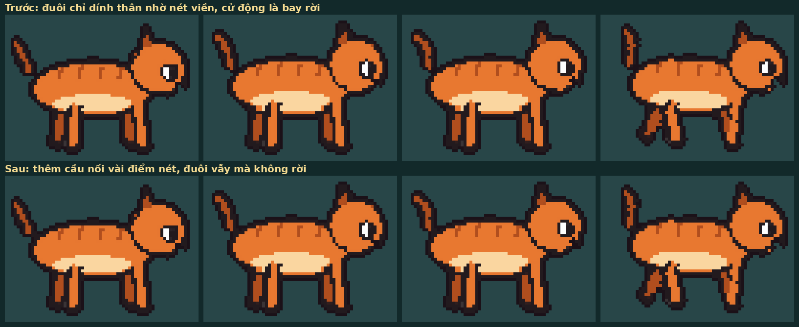

### 4. Chuyển động
Xem đủ động tác game cần: **Đứng thở, Đi, Chuẩn bị đánh, Đánh, Trúng đòn, Chết** (em bé có thêm **Né lăn**), trên nền phòng game, cạnh em bé thật để so cỡ. Có quay trái/phải, phóng to, so với hình code.

- **Biên độ**: động tác mạnh hay nhẹ. **Tốc độ**: chỉ có ở Đứng thở và Đi; các động tác đánh, trúng đòn, chết dài đúng như quái gốc để luật chơi không đổi.
- **Bộ phận nào cử động**: mỗi bộ phận (thân, đầu, tay, chân, đuôi, cánh…) có ô **Đứng yên**.
  - Bộ phận đứng yên không xoay, không lắc, không nhún riêng; nó chỉ đi theo bộ phận nó gắn vào (ví dụ đầu gắn vào thân).
  - **Thân (cả người)** đứng yên thì cả hình không lắc, không nhún, không lao tới: chỉ bộ phận còn lại cử động. Riêng **Chết** (ngã) và **Né lăn** vẫn ngã, lăn cả người để người chơi thấy rõ.
  - **Em bé (mẫu Người)**: mặc định **đầu và thân đứng yên, chỉ tay và chân cử động**. Mẫu khác giữ như cũ (mọi bộ phận cử động) nhưng vẫn bật tắt được.
  - **Độ nhún cả người**: 0% là không nhấp nhô khi đứng thở và đi; 100% như cũ; 200% nhún mạnh.
  - Lựa chọn được lưu trong tệp `.sprite.json`; vào game cũng đúng như vậy (bộ phận đứng yên không cử động trong game). **Về mặc định của mẫu** để trả lại như ban đầu.

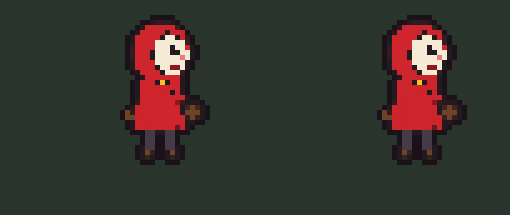
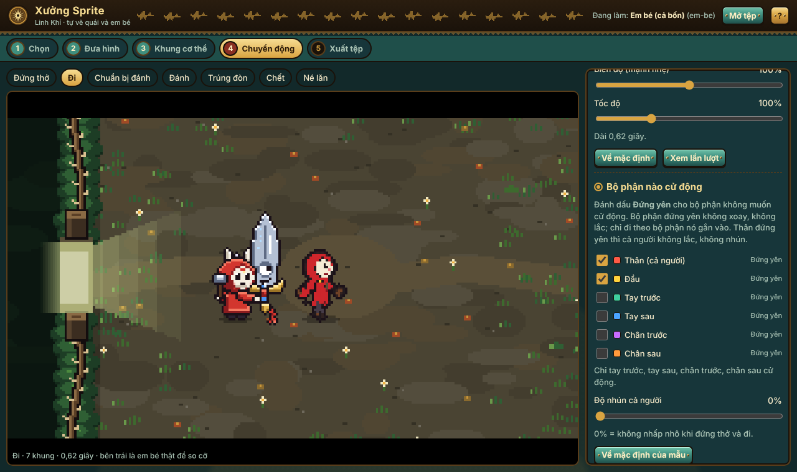
- **Xem trong game**: mở bản game thử ngay trong công cụ, quái của bạn đánh nhau thật trong phòng (bé không chết, không đụng bản lưu thật). Bấm **Cho bé tự đánh** để xem.

### 5. Xuất tệp
Bấm **Tải về `<mã>.sprite.json`**, rồi gửi tệp đó cho Claude (xem [DUA-VAO-GAME.md](DUA-VAO-GAME.md)). **Tải ảnh .png** chỉ để xem. Muốn sửa tiếp hôm khác: bấm **Mở tệp** ở góc trên và chọn tệp `.sprite.json`. Bài đang làm cũng được tự lưu nháp trong máy.

## Vũ khí, trang phục, vật phẩm

Cũng 5 bước như quái, chỉ khác bước 3 và 4. Ở bước 1 mở nhóm **Vũ khí** (Kiếm, Cung, Giáo, Búa, mỗi loại 10 dòng), **Trang phục** (Mũ, Áo, Đồ đeo lưng, Bùa và vật cầm tay, Dấu mặt nạ, Cánh) hoặc **Đồ và tài nguyên** (vàng, bình máu, linh khí ba hệ, quặng, đá tôi, nguyên liệu ba vùng, mảnh trùm, kinh nghiệm). Prompt nhờ AI vẽ từng món (có nét phá cách dân gian) ở [PROMPT-VE.md](PROMPT-VE.md) phần 2; bộ prompt cũ vẫn ở [PROMPT-AI.md](PROMPT-AI.md).

**Vũ khí**
- Vẽ kiếm, giáo, búa **nằm ngang, chuôi bên trái, mũi hướng sang phải** (như prompt trong PROMPT-VE.md), hoặc **dựng đứng, mũi lên trên**: công cụ tự nhận ra và đặt sẵn điểm cầm, mũi. Vẽ cung **dựng đứng, bụng cung quay sang phải**.
- Bước 2: thanh "Chiều cao trong game" của vũ khí là **chiều dài** vũ khí (cạnh dài), tự đặt bằng vũ khí gốc.
- Bước 3: **chạm vào chỗ chuôi** là hình thoi đỏ (điểm cầm tay) tới đó; kéo **chấm vàng** vào mũi. Cung: bật "Có dây cung", kéo hai chấm xanh vào hai đầu dây; game tự vẽ dây và mũi tên khi giương.
- "Áp dụng cho": **Cả dòng** (mọi hệ, mọi giai đoạn dùng một hình) hoặc một hệ (Lửa, Độc, Băng) và giai đoạn (Mầm, Thành hình, Thức tỉnh) để vũ khí đổi hình khi thức tỉnh. Mỗi lựa chọn là một tệp riêng.
- Bước 4: xem em bé đứng, chạy, đánh, né, trúng đòn với vũ khí; **Tám hướng**: tám hình vũ khí đúng như game xoay quanh điểm cầm (chấm đỏ); xem ô đồ và đồ rơi; thử bậc Lam, Tím, Vàng (viền đổi màu bậc). Ánh hệ, vệt chém khi đánh game vẫn tự thêm như cũ.
- Đừng vẽ mắt quá nhỏ: game không vẽ thêm mắt cho vũ khí tự vẽ.

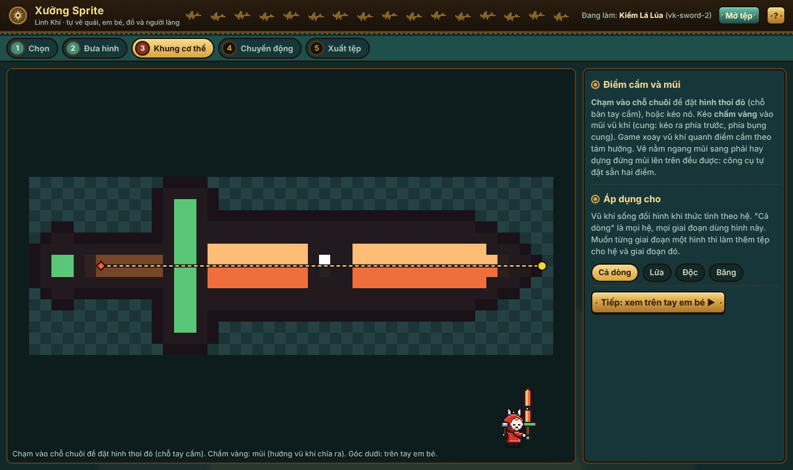
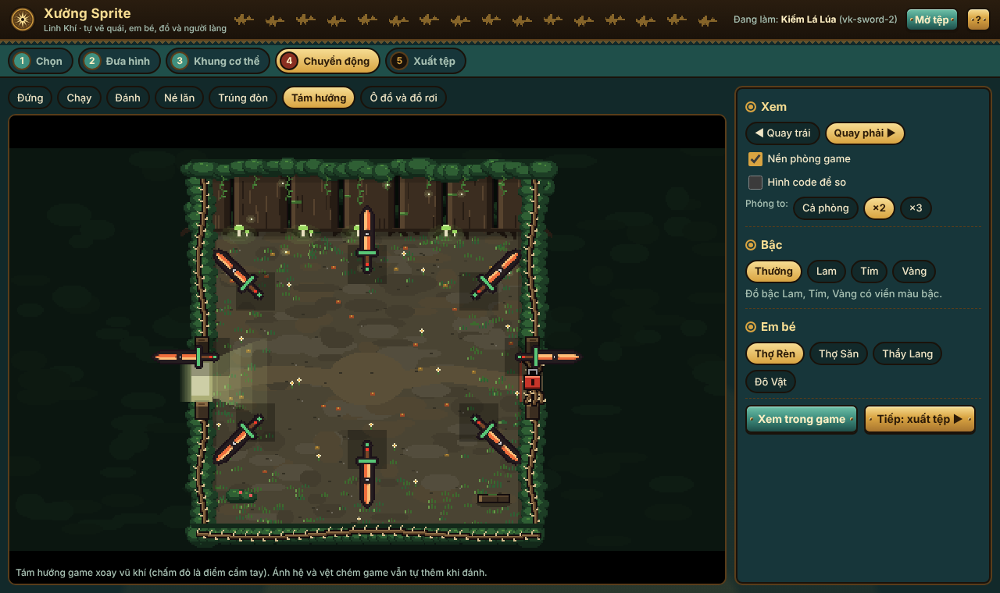

**Trang phục**
- Vẽ riêng món đồ (không vẽ em bé), nhìn ngang, quay sang phải. Cánh: vẽ **một bên cánh**, gốc cánh ở góc dưới bên phải; game tự vẽ cánh xa và cho cánh vỗ.
- Bước 3: kéo món đồ trên em bé bên phải cho vừa (nút mũi tên để nhích từng điểm ảnh). Em bé bên trái mặc đồ gốc để so. Mũ có "Che cả mặt"; bùa chọn "Bùa đeo hông" hoặc "Vật cầm tay"; áo có "Có tay áo".
- Góc trên bên phải của bước 3 có ngay ba dáng nhỏ **Đứng · Đi · Đánh**, đổi theo lúc bạn kéo. Bước 4 có cảnh **Đứng · Đi · Đánh** to.
- Đồ tự vẽ tự bám theo đầu, thân em bé khi chạy, đánh, lăn né. Ô đồ trong Hành trang và đồ rơi cũng đổi theo.

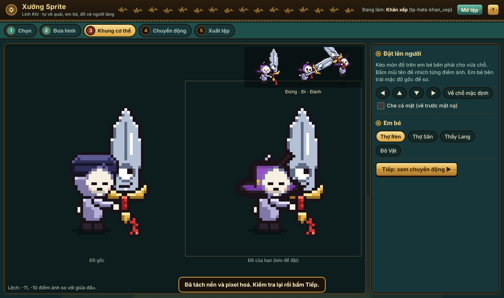

**Đồ và tài nguyên**
- Hình rất nhỏ (khoảng 14 đến 18 điểm ảnh): vẽ khối đơn giản, màu tương phản. Không có bước 3.
- Một hình đổi ở **mọi chỗ** hiện món đó: dải tài nguyên ở góc trên màn hình, Hành trang (thẻ Tài nguyên), giá bán và giá rèn, đồ rơi trên sàn.
- "Xem trong game": đồ rơi quanh em bé trong trận; bấm **Xem ở làng / trong trận** để thấy biểu tượng ở dải tài nguyên của làng.

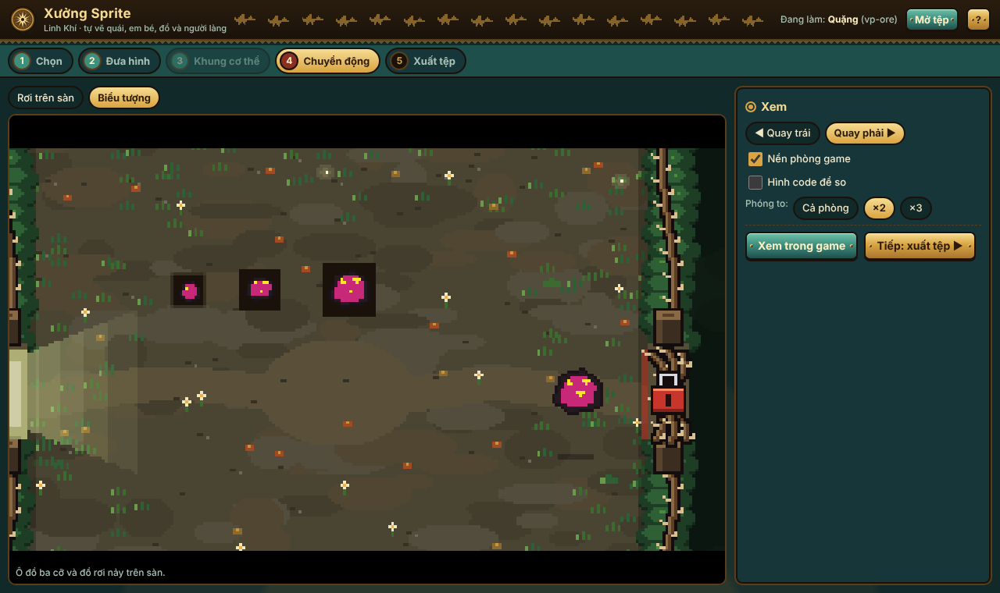

## Người làng

Bảy người làng (Chú Lái Đò, Ông Thợ Rèn, Bà Hàng Xén, Cô Thợ May, Cụ Đồ, Ông Từ, Anh Mõ) làm giống quái hai chân: mở nhóm **Người làng**, đưa hình, chọn khung **Người** (đã gợi ý sẵn), kéo khớp.

- Vẽ người **nhìn chếch sang phải**, hai tay tách khỏi thân (một tay để vẫy). Giữ mặt tròn trắng như mặt nạ tinh linh của người làng trong game cho hợp làng.
- Bước 4 chỉ có hai động tác: **Đứng thở** và **Nói chuyện, vẫy tay**, trên nền sân làng, cạnh em bé. Bật "Hình code để so" để thấy người làng gốc bên cạnh.
- Trong game: người làng tự vẽ đứng thở ở chỗ cũ; khi em bé tới gần thì quay về phía em bé, nói chuyện và vẫy tay. Khuôn mặt ở dải lối tắt trên cùng lấy phần đầu hình của bạn; khung nói chuyện (người to cạnh bảng) cũng dùng hình này.
- "Xem trong game" mở thẳng làng, em bé đứng cạnh người đó; nút **Mở / đóng khung nói chuyện** mở bảng của người đó.

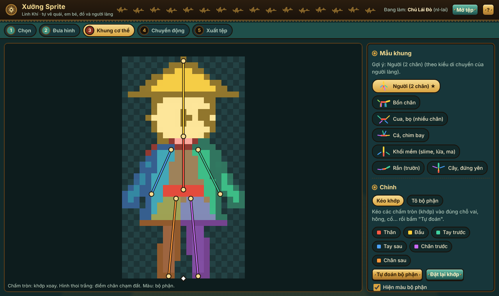
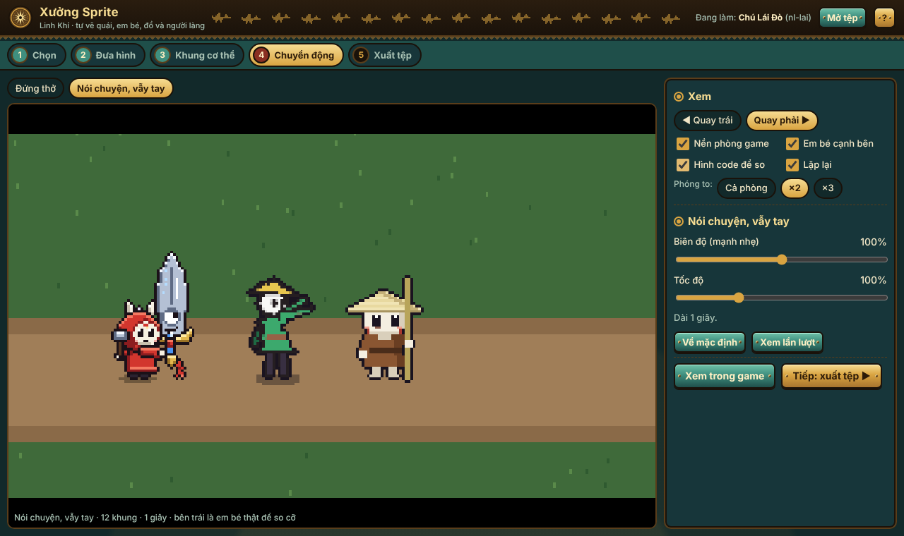
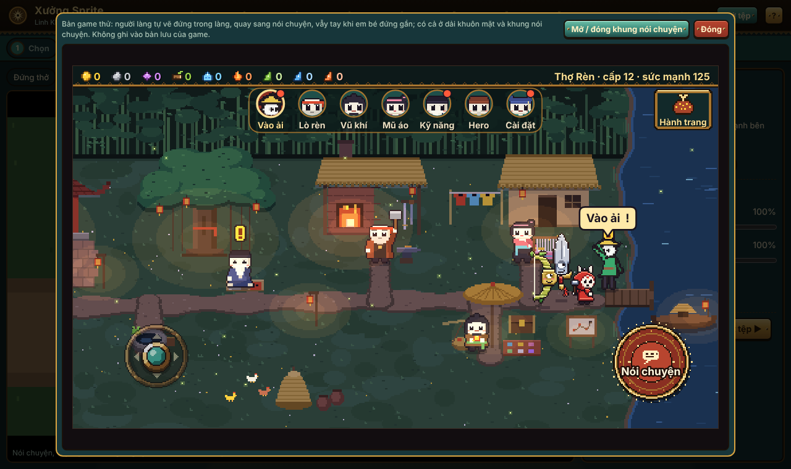

## Trước và sau trong game

| | |
|---|---|
| Làng: người làng, dải khuôn mặt, quặng ở dải tài nguyên | 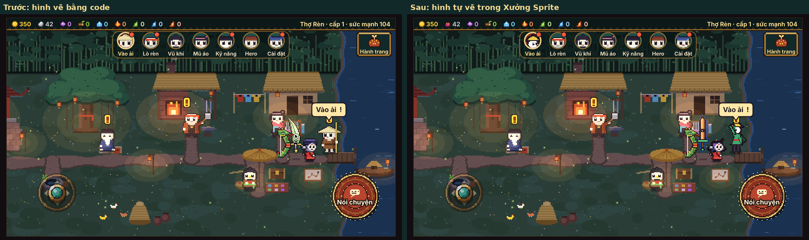 |
| Khung nói chuyện | 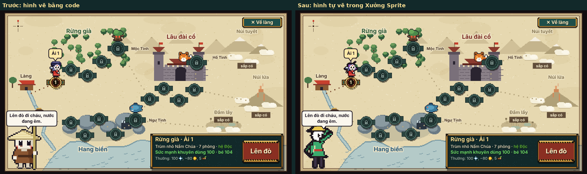 |
| Hành trang, thẻ Tài nguyên | 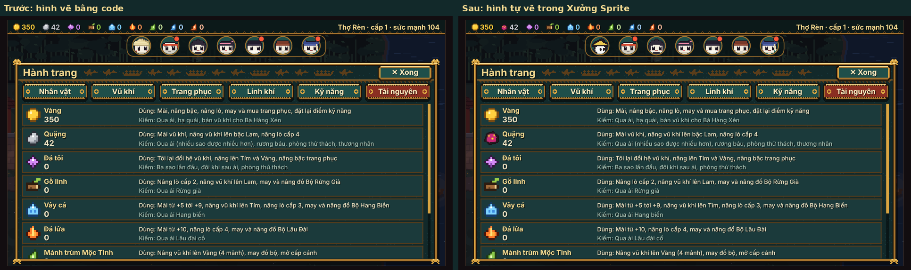 |
| Trong trận: kiếm và khăn tự vẽ | 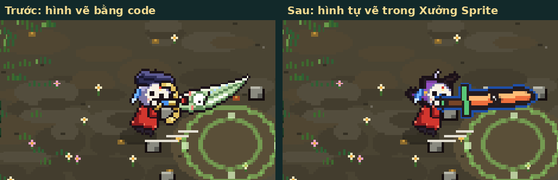 |

Mẫu ảnh vẽ tay dùng để thử: 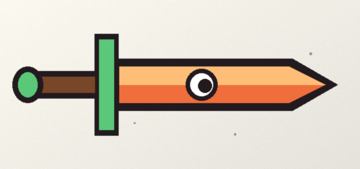 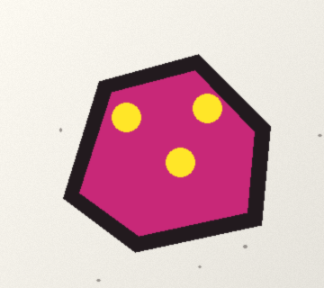 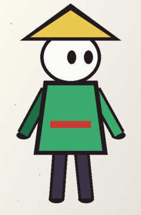

## Động tác mẫu
| Quái bốn chân tự vẽ | Em bé tự vẽ |
|---|---|
|  |  |

Dùng trên điện thoại cầm ngang:

## Hỏi nhanh
- **Mất nháp?** Nháp lưu trong trình duyệt của máy đó. Đổi máy hoặc xoá dữ liệu trình duyệt thì mất; hãy bấm Tải về để giữ.
- **Em bé tự vẽ có cầm vũ khí không?** Vũ khí vẫn do game vẽ (hoặc vũ khí bạn tự vẽ ở nhóm Vũ khí). Hãy vẽ em bé tay không.

- **Hình bị mờ, mất mắt?** Xem "So sánh cạnh nhau" ở bước 2: chỗ đỏ là sẽ mất. Dùng "Giữ nét", tăng chiều cao hoặc vẽ chi tiết to, đậm hơn.
- **Chỉ muốn tay cử động?** Bước 4, đánh dấu Đứng yên cho thân, đầu, chân; kéo Độ nhún cả người về 0%.
- **Em bé tự vẽ có cầm vũ khí không?** Vũ khí vẫn do game vẽ. Hãy vẽ em bé tay không.
- **Quái mới có vào trận ngay không?** Chưa: cần người làm code xếp nó vào vùng và vai. Trong lúc chờ, "Xem trong game" cho nó tạm đứng vào chỗ một quái có sẵn.
