# Hướng dẫn dùng Xưởng Sprite

Xưởng Sprite là công cụ để **tự vẽ hình quái và em bé** cho Linh Khí. Bạn vẽ tay (trên giấy hoặc trên máy), đưa ảnh vào, công cụ biến nó thành hình pixel có đủ động tác, rồi bạn tải tệp về gửi cho Claude để đưa vào game.

- Mở trên web: **https://spiritblade.web.app/xuong-sprite.html** (máy tính hoặc điện thoại cầm ngang). Không cần cài gì.
- Hoặc mở tệp `tools/xuong-sprite/index.html` trong repo.
- Người chơi không thấy công cụ này; game không có nút hay màn nào mới.

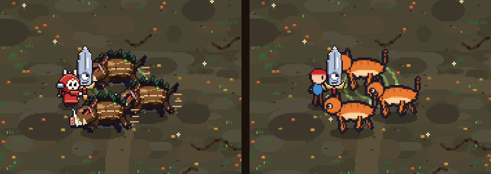

## Vẽ thế nào cho đẹp nhất

| Nên | Vì sao |
|---|---|
| **Vẽ trên giấy trắng trơn** (hoặc nền một màu), chụp thẳng, đủ sáng | Công cụ tự xoá nền dễ nhất khi nền sáng đều |
| **Con vật quay mặt sang phải**, nhìn ngang | Mọi động tác được làm cho hình quay phải; game tự lật khi quái quay trái. Lỡ vẽ quay trái thì bật "Hình quay sang trái (lật lại)" |
| **Nét viền đậm, tô màu kín**, ít màu | Hình game rất nhỏ: mảng màu lớn và nét rõ giữ được hình dáng |
| **Tay, chân, đuôi, cánh tách xa thân một chút** | Công cụ chia bộ phận dễ hơn, cử động không bị dính |
| Mắt to, đầu to | Ở cỡ nhỏ chi tiết nhỏ sẽ mất; mắt to vẫn đọc được |
| Không cần vẽ to | Hình game chỉ cao khoảng 25 đến 120 điểm ảnh; ảnh chụp bình thường là đủ |

Cỡ khuyên dùng trong game (công cụ tự đặt theo quái gốc, có thanh chỉnh):

- Quái thường: cao 25 đến 40 điểm ảnh. Tinh anh: 45 đến 65. Trùm nhỏ: 65 đến 70. Trùm vùng: 100 đến 125.
- Em bé: cao khoảng 28 điểm ảnh (cả mũ).

Mẫu ảnh vẽ tay dùng để thử: 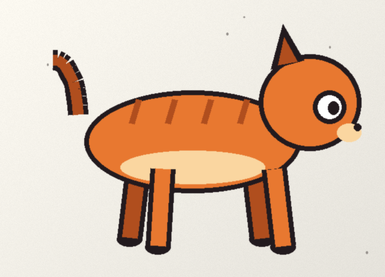

## Các bước

### 1. Chọn
Chọn quái muốn vẽ lại (hình nhỏ là hình đang có trong game để so), một em bé, hoặc **Quái mới** (đặt mã như `rongDat` và tên như `Rồng Đất`). Thẻ có nhãn **Đang làm** là bài còn nháp.

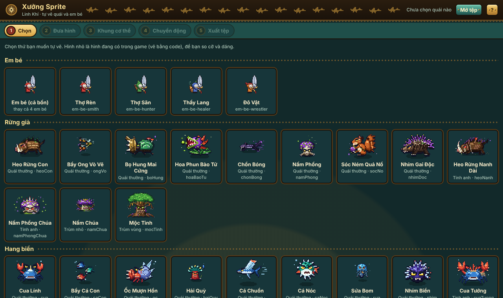

### 2. Đưa hình
Kéo thả ảnh vào khung (hoặc bấm **Chọn ảnh…**). Công cụ tự xoá nền, cắt sát, thu về cỡ game, giảm màu và thêm viền tối.

- **Ngưỡng tách nền**: kéo lên nếu còn sót nền, kéo xuống nếu mất bớt hình.
- **Từ mép vào** giữ chỗ trắng bên trong (mắt, răng). Nếu nền lọt vào giữa hai chân thì chọn **Mọi chỗ cùng màu nền**.
- **Bút giữ lại / Cục tẩy**: tô để sửa tay. Có **Hoàn tác**.
- **Chiều cao trong game**, **Số màu**, **Viền tối 1px**: chỉnh chất pixel. Bấm "Hình pixel trong game" để xem cạnh hình code cùng cỡ.

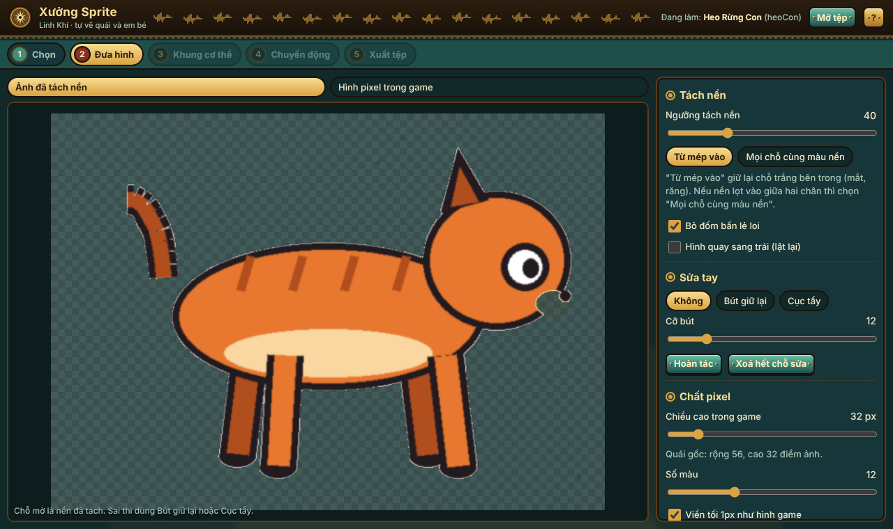
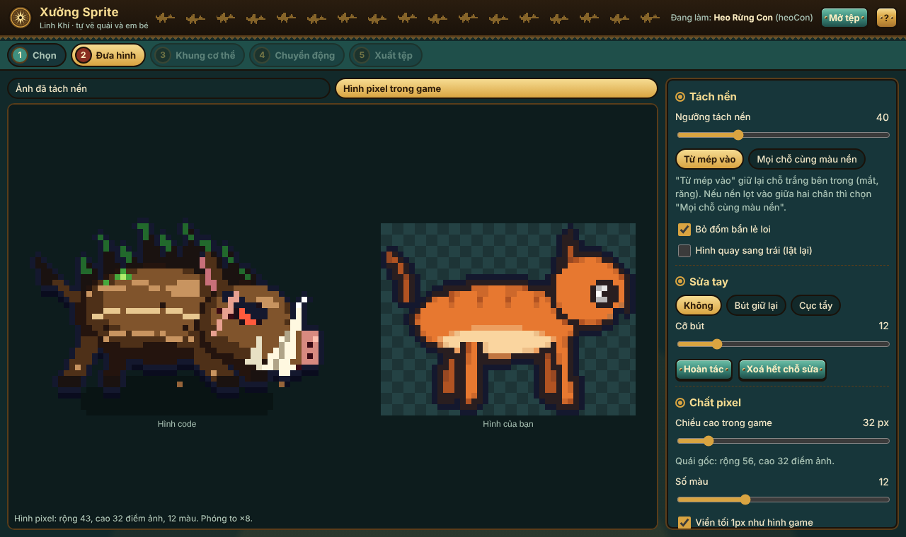

### 3. Khung cơ thể
Chọn mẫu khung (dấu ★ là gợi ý theo cách quái gốc di chuyển): **Người (2 chân)**, **Bốn chân**, **Cua, bọ (nhiều chân)**, **Cá, chim bay**, **Khối mềm (slime, lửa, ma)**, **Rắn**, **Cây, đứng yên**.

- **Kéo khớp**: kéo các chấm tròn vào đúng vai, hông, cổ, gốc đuôi… Hình thoi trắng là điểm chân chạm đất. Xong bấm **Tự đoán bộ phận**.
- **Tô bộ phận**: chọn một bộ phận (Đầu, Chân trước gần…) rồi tô lên chỗ bị chia sai.

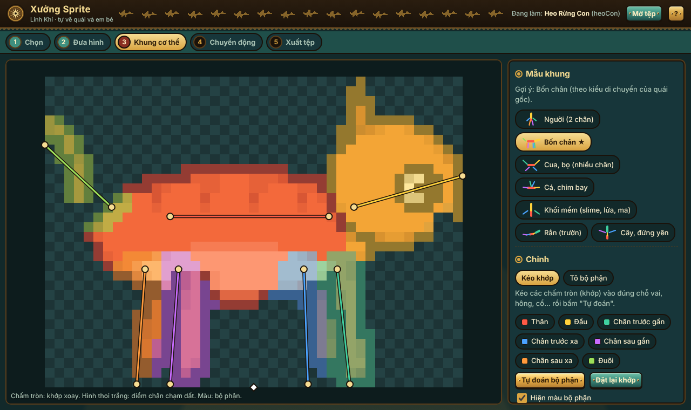

### 4. Chuyển động
Xem đủ động tác game cần: **Đứng thở, Đi, Chuẩn bị đánh, Đánh, Trúng đòn, Chết** (em bé có thêm **Né lăn**), trên nền phòng game, cạnh em bé thật để so cỡ. Có quay trái/phải, phóng to, so với hình code.

- **Biên độ**: động tác mạnh hay nhẹ. **Tốc độ**: chỉ có ở Đứng thở và Đi; các động tác đánh, trúng đòn, chết dài đúng như quái gốc để luật chơi không đổi.
- **Xem trong game**: mở bản game thử ngay trong công cụ, quái của bạn đánh nhau thật trong phòng (bé không chết, không đụng bản lưu thật). Bấm **Cho bé tự đánh** để xem.

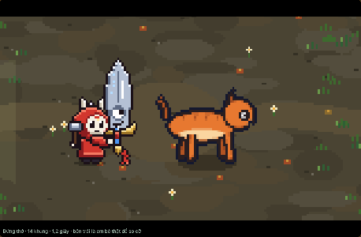
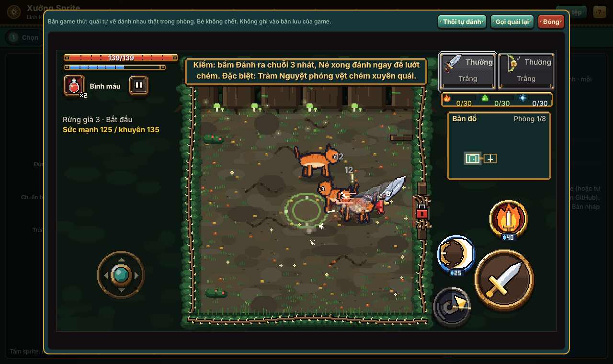

### 5. Xuất tệp
Bấm **Tải về `<mã>.sprite.json`**, rồi gửi tệp đó cho Claude (xem [DUA-VAO-GAME.md](DUA-VAO-GAME.md)). **Tải ảnh .png** chỉ để xem. Muốn sửa tiếp hôm khác: bấm **Mở tệp** ở góc trên và chọn tệp `.sprite.json`. Bài đang làm cũng được tự lưu nháp trong máy.

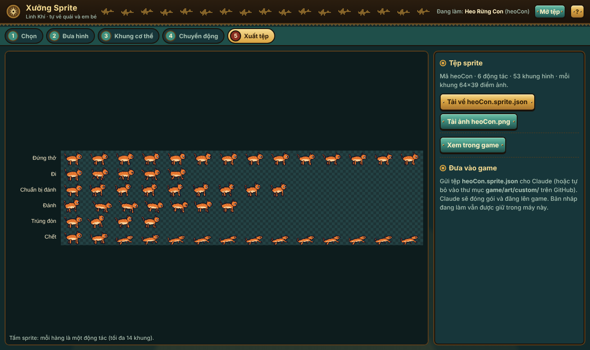

## Vũ khí, trang phục, vật phẩm

Cũng 5 bước như quái, chỉ khác bước 3 và 4. Trong danh sách bước 1, kéo xuống sẽ thấy các nhóm **Vũ khí** (Kiếm, Cung, Giáo, Búa, mỗi loại 10 dòng), **Trang phục** (Mũ, Áo, Đồ đeo lưng, Bùa và vật cầm tay, Dấu mặt nạ, Cánh) và **Vật phẩm rơi ra** (vàng, bình máu, linh khí ba hệ, quặng, đá tôi, nguyên liệu, mảnh trùm). Prompt để nhờ AI vẽ có sẵn ở [PROMPT-AI.md](PROMPT-AI.md).

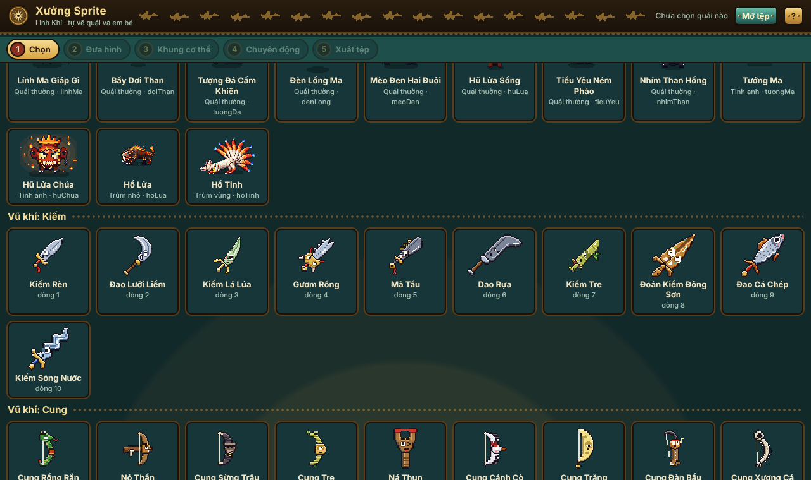

**Vũ khí**
- Vẽ kiếm, giáo, búa **dựng đứng, mũi lên trên, chuôi ở dưới**. Vẽ cung **dựng đứng, bụng cung quay sang phải**.
- Bước 3: kéo **hình thoi đỏ** vào chỗ tay cầm, **chấm vàng** vào mũi. Cung: bật "Có dây cung", kéo hai chấm xanh vào hai đầu dây; game tự vẽ dây và mũi tên khi giương.
- "Áp dụng cho": **Cả dòng** (mọi hệ, mọi giai đoạn dùng một hình) hoặc một hệ (Lửa, Độc, Băng) và giai đoạn (Mầm, Thành hình, Thức tỉnh) để vũ khí đổi hình khi thức tỉnh. Mỗi lựa chọn là một tệp riêng.
- Bước 4: xem em bé đứng, chạy, đánh, né, trúng đòn với vũ khí; xem ô đồ và đồ rơi; thử bậc Lam, Tím, Vàng (viền đổi màu bậc).
- Đừng vẽ mắt quá nhỏ: game không vẽ thêm mắt cho vũ khí tự vẽ.

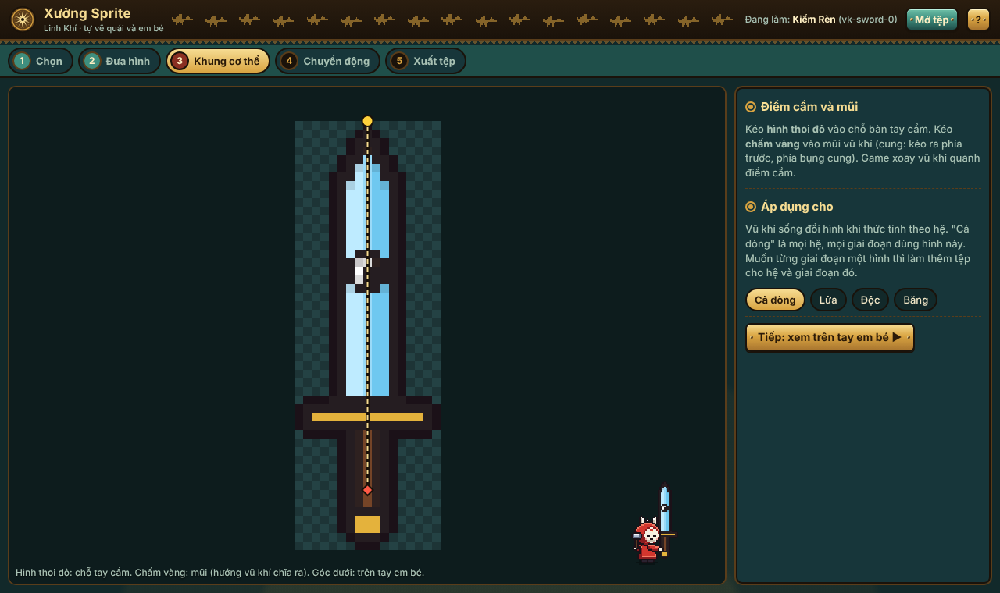
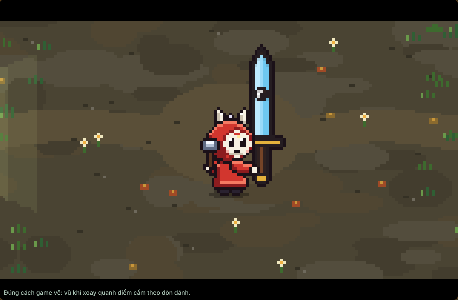

**Trang phục**
- Vẽ riêng món đồ (không vẽ em bé), nhìn ngang, quay sang phải. Cánh: vẽ **một bên cánh**, gốc cánh ở góc dưới bên phải; game tự vẽ cánh xa và cho cánh vỗ.
- Bước 3: kéo món đồ trên em bé bên phải cho vừa (nút mũi tên để nhích từng điểm ảnh). Em bé bên trái mặc đồ gốc để so. Mũ có "Che cả mặt"; bùa chọn "Bùa đeo hông" hoặc "Vật cầm tay"; áo có "Có tay áo".
- Đồ tự vẽ tự bám theo đầu, thân em bé khi chạy, đánh, lăn né. Ô đồ trong Hành trang và đồ rơi cũng đổi theo.

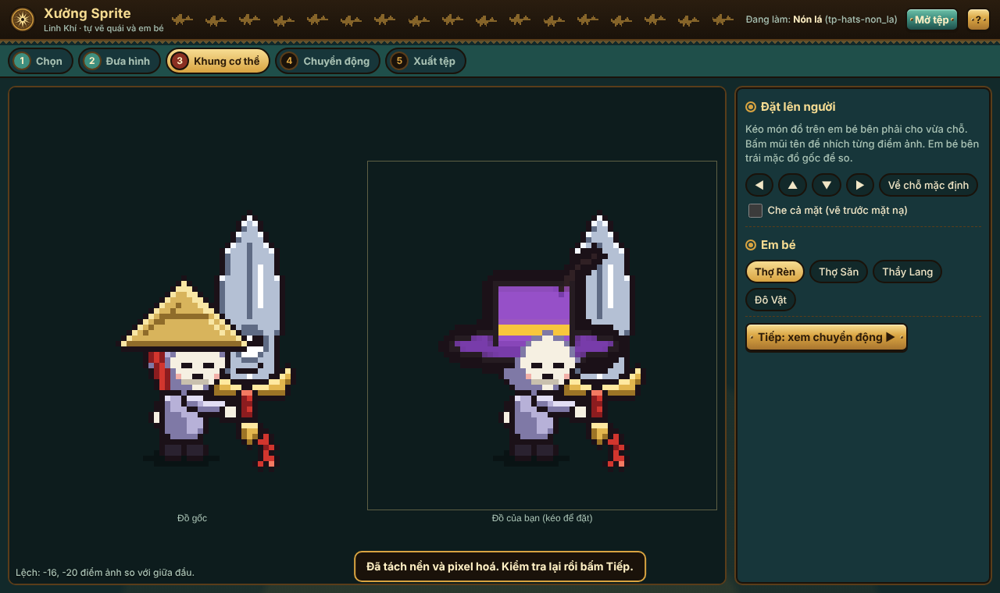
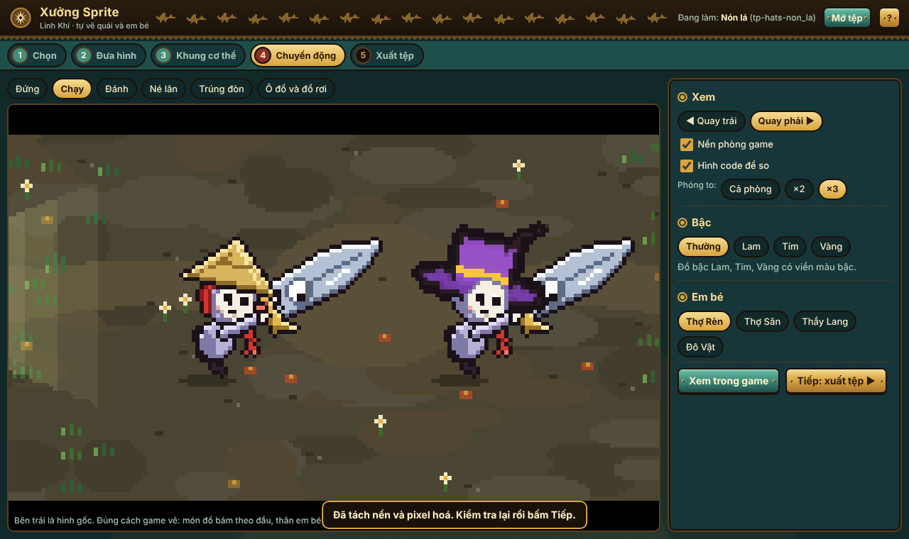

**Vật phẩm**
- Hình rất nhỏ (khoảng 14 đến 18 điểm ảnh): vẽ khối đơn giản, màu tương phản. Không có bước 3.
- Đổi cả đồ rơi trên sàn lẫn biểu tượng tài nguyên trên giao diện (dải trên cùng, giá tiền).

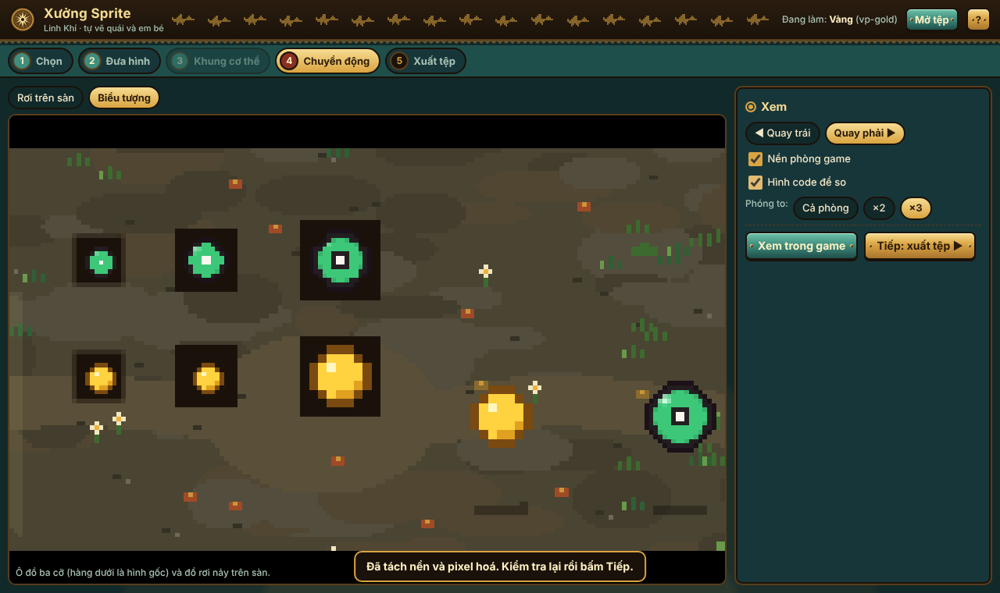
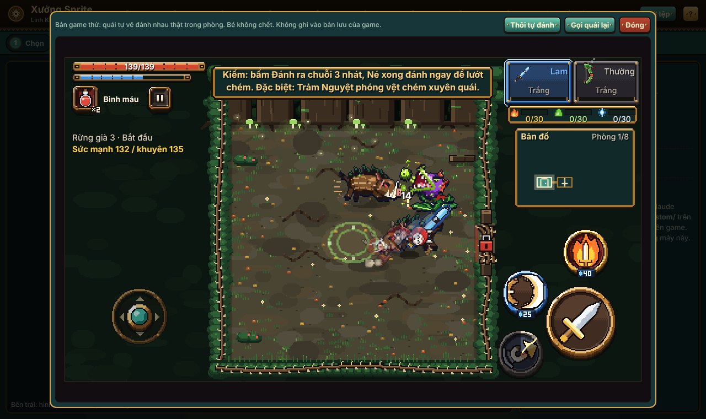

## Động tác mẫu
| Quái bốn chân tự vẽ | Em bé tự vẽ |
|---|---|
| 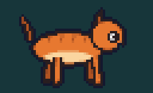 | 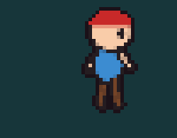 |

Dùng trên điện thoại cầm ngang:

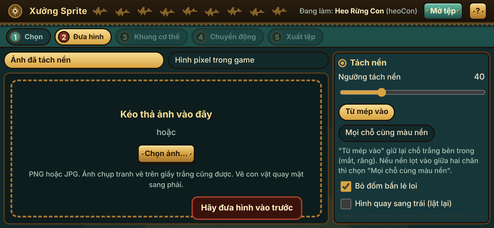

## Hỏi nhanh
- **Mất nháp?** Nháp lưu trong trình duyệt của máy đó. Đổi máy hoặc xoá dữ liệu trình duyệt thì mất; hãy bấm Tải về để giữ.
- **Em bé tự vẽ có cầm vũ khí không?** Vũ khí vẫn do game vẽ. Hãy vẽ em bé tay không.
- **Quái mới có vào trận ngay không?** Chưa: cần người làm code xếp nó vào vùng và vai. Trong lúc chờ, "Xem trong game" cho nó tạm đứng vào chỗ một quái có sẵn.
