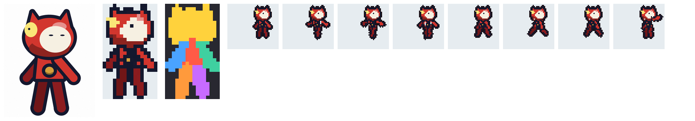
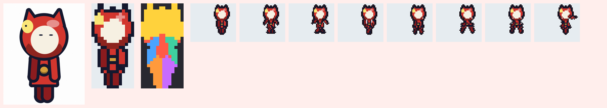
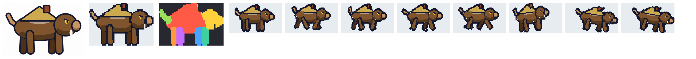
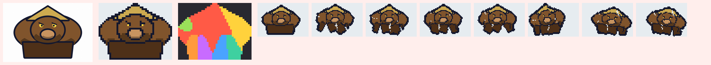
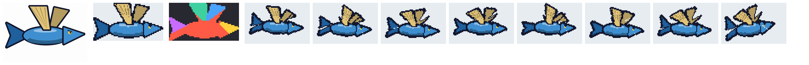
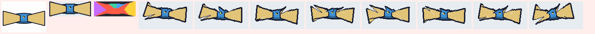
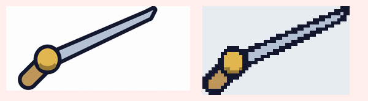

# Thử thật prompt mới với Xưởng Sprite

Không gọi được công cụ vẽ AI từ máy chạy thử, nên Claude **vẽ ảnh giả lập đúng như prompt mô tả** (góc nhìn, tỉ lệ, tay chân tách thân, nền gần trắng có nhiễu nhẹ, viền tối, mép mềm như ảnh AI), rồi cho chạy qua đúng quy trình của Xưởng Sprite bằng Chromium: **tách nền → thu nhỏ → Tự đoán bộ phận → dựng mọi động tác**. Mỗi mẫu có thêm một ảnh **"kiểu AI hay vẽ"** (nhìn chính diện, tay chân dính thân) để so.

Cách chấm: biết trước điểm nào là đầu, thân, tay, chân... trong ảnh vẽ, nên đếm được **bao nhiêu phần trăm điểm ảnh của từng bộ phận được Tự đoán gán đúng**. Vũ khí: xem điểm cầm Xưởng tự đặt có rơi vào chuôi không. Làm lại: `python3 docs/xuong-sprite/tham-chieu/thu_prompt.py`.

## Kết quả

| Mẫu | Ảnh | Cỡ ra (game) | Gán đúng bộ phận | Kết luận |
|---|---|---|---|---|
| **Em bé Thợ Rèn**, đúng prompt mới (đầu 2/5, tay tách, chân lộ) |  | 16 × 28 (game 19 × 31) | đầu 87%, tay trước 86%, tay sau 100%, hai chân 100%, thân 49% | **Khớp.** Tay chân cử động đúng, không rách hình. Phần thân bị chia một ít sang vai, nhưng em bé mặc định thân đứng yên nên không thấy lỗi. |
| Em bé, đầu 1/2 như game (bản prompt đầu tiên) | (lần chạy trước) | 14 × 28 | đầu 75%, tay trước 59%, tay sau 80%, thân 10% | Áo bị chia sang tay chân, vì khung Người chờ cổ ở 36% chiều cao. **Đã sửa prompt em bé**: đầu 2/5, áo ngắn, chân lộ rõ. |
| Em bé kiểu AI hay vẽ (tay ép sát thân, chân khép) |  | 14 × 28 | tay trước 41%, tay sau 45%, thân 15% | Tay cử động kéo theo mảng áo. |
| **Heo Rừng Con** (khung Bốn chân), đúng prompt mới |  | 48 × 32 (game 52 × 32) | thân 86%, đầu 84%, đuôi 100%, bốn chân 79–100% | **Khớp.** Bốn chân bước đúng, đuôi vẫy, đầu gật; mái tranh và ống khói (nét lạ) giữ được. |
| Heo kiểu AI hay vẽ (chính diện, chân dính khối) |  | 41 × 32 | thân 37%, đầu 7%, chân: không tìm ra | **Vỡ hình**: khi đi, khối thân bị xé ra từng mảng (vệt trắng trong khung hình). |
| **Cá Chuồn** (khung Cá, chim bay), đúng prompt mới |  | 62 × 34 (game 53 × 35) | thân 99%, cánh gần 76%, cánh xa 75%, đầu 58%, đuôi 57% | **Khớp.** Hai quạt nan vỗ lên xuống, thân nhấp nhô. Đầu và đuôi một phần đi theo thân (vẫn liền hình, không sao). |
| Cá kiểu AI hay vẽ (vây dang ngang dính thân) |  | 93 × 34 | cánh gần 0%, cánh xa 5% | Cánh không vỗ (bị tính là thân); hình dẹt quá, rộng gần gấp đôi game. |
| **Kiếm Rèn** (vũ khí), đúng prompt mới (nằm ngang, chuôi trái) |  | 47 × 17 (game 44 × 19) | điểm cầm rơi đúng vào chuôi, mũi ở mép phải | **Khớp**, không phải chạm sửa điểm cầm. |
| Kiếm kiểu AI hay vẽ (chéo 45 độ) |  | 48 × 29 | điểm cầm rơi ra ngoài chuôi | Phải tự chạm lại chỗ chuôi; kiếm dày gần gấp rưỡi game. |

Trong mọi khung hình của mọi động tác (đứng thở, đi, chuẩn bị đánh, đánh, trúng đòn, chết, em bé thêm né lăn) của các mẫu đúng prompt, hình vẫn **liền một mảng**, không bị đứt rời.

## Rút ra

- Ba điều quyết định Xưởng cắt đúng hay sai: **góc nhìn đúng khung** (bốn chân, cá bay phải nhìn ngang quay phải), **tay chân đuôi cánh có khe trắng tách thân và nằm đúng chỗ khung chờ**, và **tỉ lệ rộng cao gần game**. Prompt mới ghi đủ cả ba cho từng hình.
- Riêng em bé, prompt cố ý cho đầu nhỏ hơn game một chút (2/5 thay vì 1/2) để khớp khung Người. Nếu vẫn muốn đầu thật to như game: ở bước 3 kéo chấm **Cổ** xuống dưới cằm rồi bấm **Tự đoán bộ phận**.
- Đây là ảnh giả lập; ảnh AI thật có thể lệch hơn. Nếu lệch: gửi kèm ảnh tham chiếu trong `tham-chieu/` và câu ghi dưới mỗi dòng prompt.
